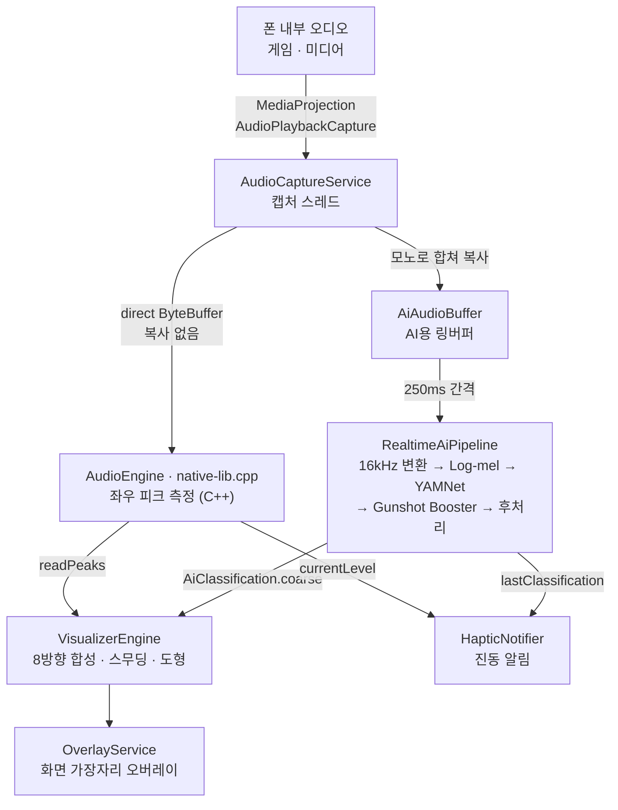

# SoundVisualizer 아키텍처

폰 안에서 재생되는 소리가 **캡처 → AI 분류 → 화면 표시·진동**으로 이어지는 흐름과, 각 단계를 맡은 코드와 스레드를 정리한 문서입니다. 기능 소개와 빌드 방법은 [README](../README.md)를 참고하세요.

## 전체 흐름

| 단계 | 코드 | 언어 |
|---|---|---|
| 홈·설정·도움말 화면 | `MainActivity`, `SettingsManager`, `help/`, `language/` (앱 언어) | Kotlin (Compose) |
| 켜기·끄기 | `VisualizerController`, `tile/` (빠른 설정 타일) | Kotlin |
| 캡처 | `AudioCaptureService` | Kotlin |
| 좌우 피크 측정 | `AudioEngine`, `cpp/native-lib.cpp` | C++ (JNI) |
| AI 분류 | `ai/` | Kotlin + ONNX Runtime |
| 분류 결과 연결 | `AiClassification` | Kotlin |
| 오버레이 | `OverlayService`, `VisualizerOverlay`, `VisualizerEngine`, `VisualizerInputs`, `VisualMode` | Kotlin (Compose Canvas) |
| 진동 | `feedback/` | Kotlin |

---

## 1. 시작과 종료

시작과 종료는 앱의 버튼과 빠른 설정 타일이 같은 코드(`VisualizerController`)를 씁니다. 권한 목록(`requiredPermissions`), 서비스 시작(`start`), 종료(`stop`)가 여기 있습니다. 권한을 묻고 거부됐을 때 안내하는 흐름과 그 안내 창(`CapturePermissionFlow`)도 함께 씁니다.

**앱에서 시작** (`MainActivity`)

1. 다른 앱 위에 표시 권한(`SYSTEM_ALERT_WINDOW`)을 확인하고, 없으면 설정 화면으로 보냅니다.
2. 녹음(`RECORD_AUDIO`)과 알림(`POST_NOTIFICATIONS`, Android 13 이상) 권한을 요청합니다. 알림 권한은 거부해도 이어서 켭니다.
   - 녹음 권한이 필요하면 시스템 창보다 먼저 이유를 설명하는 창을 띄웁니다. 시스템 창에는 "마이크"라고만 떠서 녹음 앱으로 오해하고 거부하기 쉽기 때문입니다. 알림 권한만 필요하면 바로 묻습니다.
   - 녹음 권한이 거부됐는데 `shouldShowRequestPermissionRationale`이 `false`면 시스템이 더는 창을 띄우지 않는 상태로 보고, 앱 정보 화면(`ACTION_APPLICATION_DETAILS_SETTINGS`)을 여는 안내 창을 띄웁니다. 그 밖의 거부는 토스트로 알리고 멈춥니다.
   - 안내 창 상태는 액티비티의 저장 상태(`SavedStateRegistry`)에 두어 화면을 돌려도 남습니다. 창을 다시 그릴 뿐 권한 요청이나 동의 창을 다시 띄우지 않습니다.
3. 화면 녹화 동의 창(`MediaProjection`)을 띄웁니다. 오디오 캡처에도 이 동의가 필요합니다.
4. 동의하면 `AudioCaptureService`(포그라운드 서비스)와 `OverlayService`를 함께 시작합니다.

**빠른 설정 타일에서 시작** (`tile/VisualizerTileService` → `tile/StartVisualizerActivity`)

- 권한 팝업과 동의 창은 액티비티에서만 띄울 수 있어서, 타일은 투명 화면을 열고 알림창을 접습니다. 잠금 화면이면 잠금 해제를 먼저 요구합니다(`unlockAndRun`).
- 투명 화면은 위 2~4단계를 그대로 밟고 닫힙니다. 권한 안내 창도 이 화면 위에 그리고, 취소하거나 설정 화면으로 보내면 바로 닫힙니다. 오버레이 권한만은 설정 화면이 필요해 앱을 열어 안내합니다.
- 투명 화면은 `taskAffinity=""`로 앱과 다른 작업에 뜹니다. 그래서 앱이 백그라운드에 있어도 앱 화면이 올라오지 않고, 닫히면 보던 게임·영상으로 돌아갑니다.
- 타일은 알림창이 열려 있는 동안 `SettingsManager.isServiceRunning`을 구독해 켜짐·꺼짐을 표시합니다. 추가·제거될 때는 `SettingsManager.tileAdded`에 기록해 홈 화면의 "빠른 설정에 추가" 버튼을 숨기거나 보입니다.

**종료**: 아래 경우 모두 캡처·오버레이·AI·진동을 함께 내립니다.

- 앱의 실행 종료 버튼, 켜진 상태에서 타일 누르기, 또는 알림의 **중지** 버튼(`ACTION_STOP`)
- 사용자가 시스템 UI에서 화면 녹화를 끈 경우(`MediaProjection.Callback.onStop`)
- 오디오 서버 재시작 등으로 캡처 읽기가 실패한 경우

`onDestroy`는 `AudioRecord`를 멈춘 뒤 캡처 스레드가 끝날 때까지 기다리고 나서 해제합니다. 스레드가 아직 읽는 중에 해제하면 네이티브에서 크래시가 나기 때문입니다.

---

## 2. 오디오 캡처

- **API**: `AudioPlaybackCaptureConfiguration`으로 미디어·게임·알 수 없음 용도의 소리를 받습니다. 캡처를 막아둔 앱의 소리는 받을 수 없습니다(Android 정책).
- **형식**: 스테레오 float PCM. 샘플레이트는 기기 출력 레이트를 우선 쓰고, 안 되면 48kHz → 44.1kHz 순으로 시도합니다. 출력과 다른 레이트를 요청하면 캡처 경로에 리샘플러가 끼어 지연이 늘기 때문입니다.
- **캡처 스레드** `SV-AudioCapture` (`THREAD_PRIORITY_URGENT_AUDIO`)가 한 번에 1024 float(512프레임)씩 읽고, 읽을 때마다 두 곳으로 넘깁니다.
  1. **시각화용**: `AudioRecord`가 채운 direct `ByteBuffer`를 `AudioEngine.pushAudioBuffer`로 넘깁니다. JNI가 버퍼 주소를 그대로 읽으므로 복사와 할당이 없습니다.
  2. **AI용**: 재사용하는 `FloatArray`에 복사해 `AiAudioBuffer`에 넣습니다. 여기서 좌우를 평균해 모노로 합칩니다. 추론은 캡처 스레드에서 하지 않습니다.

### 좌우 피크 측정 (`native-lib.cpp`)

C++은 **버퍼마다 좌우 채널의 최대 진폭(max|sample|)만** 계산합니다. 방향 계산은 오버레이 쪽 Kotlin에서 합니다.

| 함수 | 반환 | 읽은 뒤 |
|---|---|---|
| `readPeaks(out)` | `[좌 피크, 우 피크, 도착한 버퍼 수]` (지난 호출 이후 최대값) | 0으로 초기화 |
| `currentLevel()` | 가장 최근 버퍼의 좌우 중 큰 값 | 유지 |

상태는 정적 `std::atomic` 뿐이라 락이 없습니다. 오버레이가 `readPeaks`로 값을 가져가며 초기화하므로, 진동 알림처럼 다른 곳에서 읽을 때는 `currentLevel`을 씁니다.

---

## 3. AI 분류 (`ai/`)

### 준비

- 서비스가 시작되면 `SV-AiInit` 스레드(`THREAD_PRIORITY_BACKGROUND`)가 `RealtimeAiPipeline.create`로 모델을 불러옵니다. 서비스 시작을 막지 않기 위해서입니다.
- YAMNet은 가중치가 별도 파일(`yamnet.data`, 약 15MB)이라, ONNX Runtime이 파일 경로로 찾을 수 있게 assets에서 앱 내부 저장소로 복사한 뒤 세션을 만듭니다.
- 로딩이 끝나기 전이나 모델 로딩이 실패하면 분류 결과가 없고, 오버레이는 모든 소리를 **환경음**으로 그립니다.

### 분석 주기

코루틴(`Dispatchers.Default`)이 분석 한 번을 마치고 **250ms 쉰 뒤** 다음 분석을 합니다. 한 번의 분석은 다음 순서입니다.

1. **입력 자르기**: 링버퍼에서 최근 약 0.975초(16kHz 기준 15,600샘플)를 가져옵니다.
2. **16kHz 변환**: 캡처 레이트의 소리를 16kHz로 바꿉니다. (`CaptureAudioMath`)
3. **Log-mel 스펙트로그램**: Kotlin으로 계산합니다. (`AudioPreprocessor`: 25ms 창, 10ms 간격, 64개 멜 대역, 96프레임 → `[1, 1, 96, 64]`)
4. **YAMNet 추론**: 521개 소리 클래스의 확률을 냅니다. (`YamnetInference`, 연산 스레드 1개로 제한해 캡처·렌더와 CPU를 다투지 않게 함)
5. **3종 분류**: 상위 클래스들을 투표해 환경음(`ambient`)·대화음(`speech`)·위협음(`danger`)으로 묶습니다. (`YamnetCoarseClassifier`, `YamnetThreeClassMapper`)
6. **Gunshot Booster**: 521개 확률을 입력으로 받는 작은 모델이 총소리 점수를 내고, 위협음으로 올릴지 정합니다. (`GunshotBoosterInference`, `GunshotBoosterDecision`)
7. **후처리**: 확신도 기준과 히스테리시스를 적용해 라벨이 매번 흔들리지 않게 합니다. 위협음은 다른 종류보다 빨리 전환됩니다. 확신도가 기준에 못 미치면 **이전 라벨을 유지**합니다. (`AiPostProcessor`)
8. 결과를 `AtomicReference`에 저장합니다. 읽는 쪽은 락 없이 가져갑니다.

### 결과 전달 (`AiClassification`)

캡처 서비스와 오버레이 서비스는 서로를 모릅니다. 캡처 쪽이 파이프라인을 만든 뒤 결과를 읽는 함수를 `AiClassification.attach`로 걸어두고, 오버레이는 `AiClassification.coarse()`만 호출합니다. 분류기가 없으면 항상 `ambient`를 돌려줍니다.

### 기준 구현과 검증

- `tools/ai_reference/`: 전처리·추론의 Python 기준 구현과 골든 데이터 생성 스크립트
- 유닛 테스트(`app/src/test/.../ai/`): 전처리 골든 비교, 분류 매핑, Booster 판정, 후처리
- 계측 테스트(`app/src/androidTest/.../ai/`): 실제 ONNX 모델 추론 비교 (기기 필요)

---

## 4. 오버레이

| 코드 | 역할 |
|---|---|
| `OverlayService` | 오버레이 창을 띄우고 내리는 서비스 |
| `VisualizerOverlay` | 창 안에서 도는 Compose 렌더 루프 |
| `VisualizerEngine` | 피크를 8방향 깊이·도형으로 바꾸고 캔버스에 그리는 엔진 |
| `VisualizerInputs` | 엔진이 읽는 바깥 입력 인터페이스와 실제 연결(`LiveVisualizerInputs`) |
| `VisualMode` | 네 가지 표현 모드 (파도·패드·원형·외곽선) |

### 창 (`OverlayService`)

`WindowManager`에 `TYPE_APPLICATION_OVERLAY` 창을 띄우고 그 안에 `ComposeView`를 둡니다.

- `FLAG_NOT_TOUCHABLE`, `FLAG_NOT_FOCUSABLE`: 터치와 입력이 아래 앱(게임)으로 그대로 전달됩니다.
- 창 불투명도(`alpha`): Android 12 이상은 `InputManager.maximumObscuringOpacityForTouch`(기본 0.8)로 맞춥니다. 다른 앱 위에 겹친 창이 이 값보다 불투명하면 시스템이 아래 앱으로 가는 터치를 막기 때문입니다(신뢰할 수 없는 터치 차단).
- `FLAG_LAYOUT_NO_LIMITS`, `FLAG_LAYOUT_IN_SCREEN`: 상태바·내비게이션 바 영역까지 화면 전체에 그립니다.

### 렌더 루프 (`VisualizerOverlay`)

- `withFrameNanos`로 화면 프레임마다 `VisualizerEngine.tick`을 부르고, 다시 그릴 필요가 있을 때만 그리기를 무효화합니다. 리컴포지션은 일어나지 않습니다.
- 그리기는 Compose `Canvas`의 `nativeCanvas`(`android.graphics.Canvas`)에 `Path`·`Paint`·`Shader`로 합니다. OpenGL은 쓰지 않습니다.
- 모든 버퍼·`Path`·`Paint`를 미리 만들어 두어 **프레임당 힙 할당이 없습니다.**
- 120Hz 화면에서도 **최대 60fps**로 제한합니다.

### 한 프레임의 계산 (`VisualizerEngine.tick`)

1. **피크 읽기**: 새 버퍼가 왔으면 그 피크를, 아니면 이전 값을 프레임마다 0.87배로 줄입니다.
2. **8방향 합성**: 좌우 2채널을 Mid/Side로 나눠 화면 둘레 8방향(상단 중앙, 우상단, 우측, 우하단, 하단 중앙, 좌하단, 좌측, 좌상단)의 세기로 펼칩니다. **공간 리플 효과**가 켜져 있으면 뒤쪽 방향은 몇 프레임 늦은 값을 써서 앞에서 뒤로 퍼지는 느낌을 냅니다.
3. **스무딩**: 전체 크기(**민감도**)와 방향 분포(**속도**)를 따로 따라갑니다. 계수는 60fps 기준으로 시간 보정해 90/120Hz 화면에서도 같은 느낌이 나게 합니다.
4. **깊이**: **크기** 100%가 화면 중앙 한계선에 닿도록 방향별 깊이(px)를 정합니다.
5. **색·진하기·광원**: AI 라벨에 맞는 색으로 **즉시** 바꾸고(위협음은 서서히 물드는 것보다 바로 뜨는 편이 낫습니다), 그 종류의 표시가 꺼져 있으면 그리지 않습니다. 기본색은 환경음 흰색, 대화음 노란색, 위협음 빨간색입니다.
6. **도형**: 모드에 따라 파도·외곽선(화면 둘레를 따라가는 곡선), 패드(가장자리 막대), 원형(모서리 파문)을 계산합니다.
7. **쉬기(idle)**: 1초 넘게 아무것도 안 보이고, 조용하거나 지금 설정으로는 그릴 수 없으면(표시 꺼짐, 진하기·크기 0) 프레임 루프를 멈추고 33ms 간격 확인으로 내려갑니다. 소리가 나고 그릴 수 있게 되면 다시 프레임 루프로 돌아옵니다.

`VisualizerEngine`은 바깥 입력(피크, 설정, 라벨, 색)을 `VisualizerInputs` 인터페이스로만 받습니다. 실제 구동은 `LiveVisualizerInputs`, 테스트(`VisualizerEngineTest`)는 가짜 입력을 넣어 기기 없이 검증합니다.

---

## 5. 진동 알림 (`feedback/`)

| 코드 | 역할 |
|---|---|
| `HapticNotifier` | 실행 루프. 라벨과 소리 크기를 주기적으로 읽어 판단을 맡기고 결과대로 울림 |
| `HapticPolicy` | 언제 울릴지 판단하는 순수 로직 (기기 없이 테스트) |
| `HapticPlayer` | 패턴·세기에 맞춰 진동 재생 |
| `HapticSettings` | 종류별 켜기·세기(약·중·강)·패턴(한 번·두 번·길게·반복) |
| `HapticSettingRow` | 설정 화면의 종류별 진동 설정 줄 |

- AI 모델이 준비된 뒤 캡처 서비스가 `HapticNotifier`를 시작합니다. 진동 모터가 없는 기기에서는 시작하지 않습니다.
- `SV-Haptic` 스레드(`THREAD_PRIORITY_BACKGROUND`)가 **100ms마다** 최근 분류 라벨과 `AudioEngine.currentLevel()`을 읽습니다. AI 결과가 250ms마다 나오므로 놓치지 않습니다.
- `ai/` 코드에 콜백을 넣지 않고 결과를 읽어 가는 방식이라 AI 파트를 건드리지 않습니다.

### 라벨이 아니라 "사건"으로 판단하는 이유

후처리는 확신도가 낮으면 이전 라벨을 유지하므로, 조용해져도 마지막 라벨(예: 위협음)이 남습니다. 라벨만 보고 울리면 반복 패턴은 무음에서도 계속 울리고, "총소리 → 조용 → 총소리"에서는 라벨이 바뀐 적이 없어 두 번째를 놓칩니다.

그래서 `HapticPolicy`는 **실제로 소리가 나는 중**(크기 0.01 초과, 끊겨도 400ms까지는 같은 소리로 봄)이면서 **라벨의 화면 표시와 진동이 모두 켜진** 구간을 하나의 사건으로 봅니다.

- 사건이 시작되면 울립니다. 단, 같은 종류로 마지막에 울린 지 2초가 안 됐으면 건너뜁니다.
- **반복** 패턴은 사건이 이어지는 동안 1.5초마다 다시 울립니다.
- 기본값은 위협음만 켜짐(강, 두 번)이고 환경음·대화음은 꺼져 있습니다.

---

## 6. 설정 저장 (`SettingsManager`)

- 설정은 `StateFlow`로 들고 있고 `SharedPreferences`에 저장합니다. 설정 화면은 값을 바꾸고, 오버레이·진동은 매 프레임·매 틱마다 `.value`만 읽습니다.
- 모드별 슬라이더 값은 드래그 중에는 메모리에만 반영하고, **손을 뗄 때**와 화면을 벗어날 때(`onPause`) 저장합니다.
- 표현 모드(`VisualMode`)는 **순서(ordinal)로 저장**하므로 enum 순서를 바꾸면 기존 사용자 설정이 어긋납니다. 진동 설정의 enum은 이름으로 저장합니다.

---

## 7. 스레드 구성

| 스레드 | 우선순위 | 하는 일 |
|---|---|---|
| 메인 | 기본 | 설정 화면, 오버레이 프레임 계산과 그리기 |
| `SV-AudioCapture` | `URGENT_AUDIO` | `AudioRecord` 읽기, 피크 전달, AI 링버퍼 복사 |
| `SV-AiInit` | `BACKGROUND` | 모델 복사·세션 생성 (시작 시 한 번) |
| AI 코루틴 | `Dispatchers.Default` | 250ms 간격 분석 |
| `SV-Haptic` | `BACKGROUND` | 100ms 간격 진동 판단 |

스레드 사이에서 주고받는 값은 모두 락 없이 읽거나, 짧은 동기화 구간만 거칩니다.

| 값 | 쓰는 쪽 | 읽는 쪽 | 방식 |
|---|---|---|---|
| 좌우 피크 | 캡처 | 메인 (`readPeaks`) | C++ `std::atomic` |
| 현재 소리 크기 | 캡처 | `SV-Haptic` (`currentLevel`) | C++ `std::atomic` |
| AI 입력 소리 | 캡처 | AI 코루틴 | `AiAudioBuffer` (`synchronized` 링버퍼) |
| 분류 결과 | AI 코루틴 | 메인, `SV-Haptic` | `AtomicReference` |
| 설정 | 메인 (설정 화면) | 메인 (오버레이), `SV-Haptic` | `StateFlow.value` |

---

## 8. 앱 언어 (`language/`)

### 문구

- 화면의 문구는 모두 `res/values*/strings.xml`에 있습니다. 기본 폴더 `values`가 **영어**이고(`res/resources.properties`의 `unqualifiedResLocale=en-US`), 한국어는 `values-ko`, 그 밖의 언어는 `values-xx`입니다.
- 폰 언어의 폴더가 없거나 문구 하나가 빠져 있으면 안드로이드가 기본 폴더의 영어를 씁니다. 그래서 영어·한국어는 빠짐없이 두고(`StringResourcesTest`), 다른 언어는 빠져도 Lint 경고(`MissingTranslation`)로만 둡니다.
- 브랜드 이름(`app_name` 등)은 `values`에만 `translatable="false"`로 둡니다.
- 지원 언어 목록은 `AppLanguages`(태그, 폴더, 그 언어로 쓴 이름)입니다. 안드로이드 코드를 쓰지 않아 JVM 테스트가 `values-xx` 폴더와 목록을 맞춰 봅니다.

### 언어 적용 (`AppLanguage`)

사용자가 고른 언어가 없으면 폰 언어를 따릅니다. 설정 탭 맨 위의 언어 카드(`LanguageSettingCard`)에서 고르면 다음처럼 적용됩니다.

| | Android 13 이상 | Android 10~12 |
|---|---|---|
| 저장 | 시스템의 앱별 언어 (`LocaleManager.applicationLocales`, 비어 있으면 폰 언어) | 전용 `SharedPreferences` 파일(`AppLanguagePrefs`)의 태그 |
| 적용 | 시스템이 앱 프로세스 전체에 적용 | 글자를 보여주는 컴포넌트가 `attachBaseContext`에서 `AppLanguage.wrap`으로 `createConfigurationContext` 한 컨텍스트를 씀 |
| 바꾼 뒤 | 시스템이 액티비티를 다시 만듦 | `Activity.recreate()` |
| 폰 설정의 앱 언어 | 같은 값이라 어느 쪽에서 바꿔도 맞음 | 없음 |

- Android 12 이하에서 `wrap`을 거는 곳: `MainActivity`, `tile/StartVisualizerActivity`, `AudioCaptureService`(알림), `OverlayService`, `tile/VisualizerTileService`(타일 이름). 이 버전에서는 `applicationContext`의 언어가 바뀌지 않으므로, 토스트 문구는 액티비티에서 꺼내 넘깁니다.
- 같은 버전에서 기본 로캘(`LocaleList.setDefault`)도 고른 언어로 맞춥니다. Compose 글자가 기본 로캘로 글꼴(간체·번체·일본어 한자 모양)과 줄바꿈을 고르기 때문입니다.
- 언어 설정 파일은 `SettingsManager`와 따로 둡니다. `attachBaseContext`가 `SettingsManager.init`보다 먼저 불리기 때문입니다. 폰을 13 이상으로 올리면 앱을 처음 열 때 이 값을 시스템 설정으로 옮깁니다(`migrateLegacyChoice`).
- 언어를 바꿔 액티비티가 다시 만들어져도 `MainActivity`가 보던 탭을 저장해 두어 설정 탭에 남습니다.
- 숫자 표시는 언어와 상관없이 `Locale.US`로 형식을 맞춥니다.

### 폰 설정에 뜨는 언어 목록

`app/build.gradle.kts`의 `androidResources { generateLocaleConfig = true }`로, 빌드할 때 `values-xx` 폴더를 모아 locale config(`_generated_res_locale_config.xml`)를 만들고 매니페스트의 `android:localeConfig`에 넣습니다. Android 13 이상의 폰 설정 **앱 언어**에 이 목록이 뜹니다. 폴더를 추가하면 목록도 따라 바뀌므로 따로 고칠 파일이 없습니다.

App Bundle로 배포하더라도 앱 안에서 고른 언어의 문구가 빠지지 않도록 언어별 분할은 꺼 두었습니다(`bundle { language { enableSplit = false } }`).

### 긴 번역

번역은 영어·한국어보다 길 수 있어서, 짧은 이름표 자리는 글자가 잘리지 않게 해 두었습니다.

- 탭 줄은 넘치면 옆으로 밀립니다.
- 홈의 실행·실행 종료 버튼, 모드 선택 칸, 진동 세기·패턴 선택지는 가운데 정렬로 줄을 바꾸고, 같은 줄의 칸 높이를 함께 맞춥니다.
- 슬라이더 이름 칸은 너비가 고정이라 줄을 바꾸고, 긴 단어는 하이픈을 넣어 끊습니다(`wrappingLabelStyle`, 하이픈 규칙이 있는 언어만).
