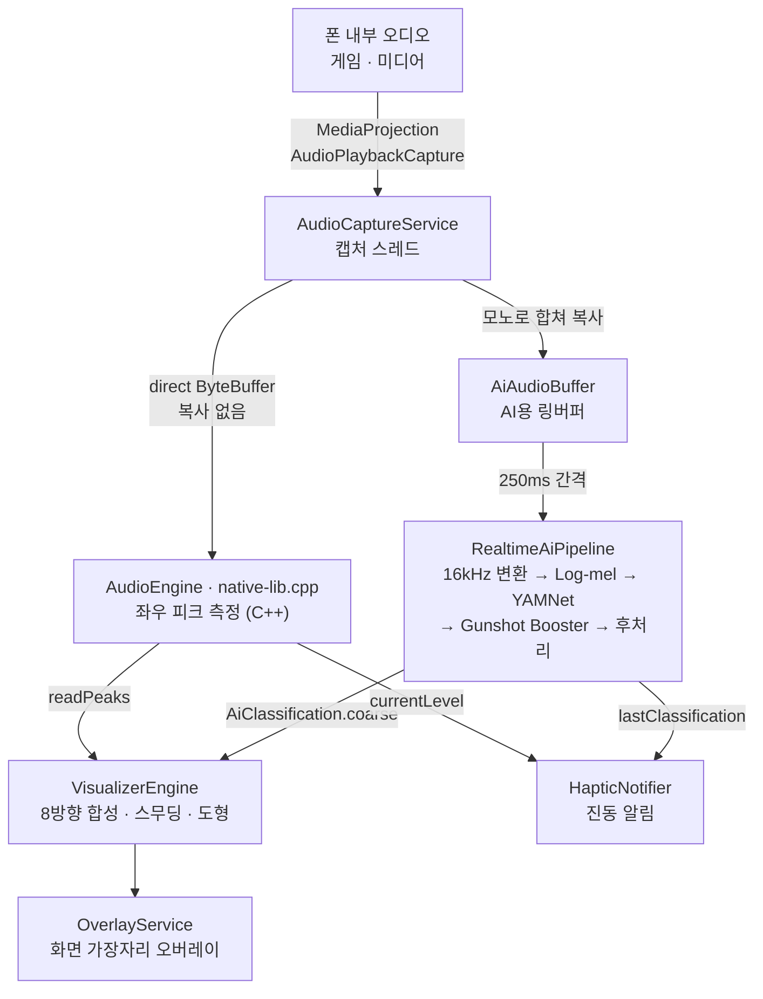

# SoundVisualizer 아키텍처

폰 안에서 재생되는 소리가 **캡처 → AI 분류 → 화면 표시·진동**으로 이어지는 흐름과, 각 단계를 맡은 코드와 스레드를 정리한 문서입니다. 기능 소개와 빌드 방법은 [README](../README.md)를 참고하세요.

## 전체 흐름



| 단계 | 코드 | 언어 |
|---|---|---|
| 홈·설정·도움말 화면 | `MainActivity`, `SettingsManager`, `help/`, `language/` (앱 언어) | Kotlin (Compose) |
| 켜기·끄기 | `VisualizerController`, `tile/` (빠른 설정 타일), `PendingStart` (권한을 켜고 돌아오면 이어서 켜기), `StopReason`·`StopAlert` (꺼짐 알림) | Kotlin |
| 캡처 | `AudioCaptureService`, `ScreenOffPause` (화면 꺼짐 일시정지), `BlockedCaptureNotice` (받을 수 없는 소리 안내), `NotificationActionReceiver` (실행 중 알림 버튼) | Kotlin |
| 좌우 피크 측정 | `AudioEngine`, `cpp/native-lib.cpp` | C++ (JNI) |
| AI 분류 | `ai/` | Kotlin + ONNX Runtime |
| 분류 결과 연결 | `AiClassification` | Kotlin |
| 오버레이 | `OverlayService`, `VisualizerOverlay`, `VisualizerEngine`, `VisualizerInputs`, `VisualMode` | Kotlin (Compose Canvas) |
| 진동 | `feedback/` | Kotlin |

---

## 1. 시작과 종료

시작과 종료는 앱의 버튼과 빠른 설정 타일이 같은 코드(`VisualizerController`)를 씁니다. 권한 목록(`requiredPermissions`), 서비스 시작(`start`), 종료(`stop`)가 여기 있습니다. 권한을 묻고 거부됐을 때 안내하는 흐름과 그 안내 창(`CapturePermissionFlow`)도 함께 씁니다.

**앱에서 시작** (`MainActivity`)

1. 다른 앱 위에 표시 권한(`SYSTEM_ALERT_WINDOW`)을 확인하고, 없으면 **먼저 안내 창을 띄운 뒤** 설정 화면으로 보냅니다. 그 화면은 기기에 따라 앱 목록만 뜨고 어느 앱을 켜야 하는지 알려주지 않아서, 설명 없이 보내면 처음 쓰는 사용자가 그냥 나가기 쉽습니다.
   - 이 화면은 결과를 돌려주지 않으므로, 허용하고 돌아온 것은 `onResume`에서 `Settings.canDrawOverlays`로 확인해 눌렀던 실행을 이어갑니다. `onResume`은 앱을 열 때마다·화면을 돌릴 때마다·다른 앱에서 돌아올 때마다 불리므로, **사용자가 실행을 눌러 설정 화면으로 보내진 경우에만 한 번** 이어갑니다(`PendingStart`, 화면을 돌려 다시 만들어져도 유지되게 `onSaveInstanceState`에 저장). 허용하지 않고 돌아왔거나 실행 종료를 누르면 버립니다. 이 규칙은 안드로이드에 의존하지 않아 JVM에서 검사합니다(`PendingStartTest`).
2. 녹음(`RECORD_AUDIO`)과 알림(`POST_NOTIFICATIONS`, Android 13 이상) 권한을 요청합니다. 알림 권한은 거부해도 이어서 켭니다.
   - 녹음 권한이 필요하면 시스템 창보다 먼저 이유를 설명하는 창을 띄웁니다. 시스템 창에는 "마이크"라고만 떠서 녹음 앱으로 오해하고 거부하기 쉽기 때문입니다. 알림 권한만 필요하면 바로 묻습니다.
   - 녹음 권한이 거부됐는데 `shouldShowRequestPermissionRationale`이 `false`면 시스템이 더는 창을 띄우지 않는 상태로 보고, 앱 정보 화면(`ACTION_APPLICATION_DETAILS_SETTINGS`)을 여는 안내 창을 띄웁니다. 그 밖의 거부는 토스트로 알리고 멈춥니다.
   - 안내 창 상태는 액티비티의 저장 상태(`SavedStateRegistry`)에 두어 화면을 돌려도 남습니다. 창을 다시 그릴 뿐 권한 요청이나 동의 창을 다시 띄우지 않습니다.
3. 화면 녹화 동의 창(`MediaProjection`)을 띄웁니다. 오디오 캡처에도 이 동의가 필요합니다.
4. 동의하면 `AudioCaptureService`(포그라운드 서비스)와 `OverlayService`를 함께 시작합니다.

**빠른 설정 타일에서 시작** (`tile/VisualizerTileService` → `tile/StartVisualizerActivity`)

- 권한 팝업과 동의 창은 액티비티에서만 띄울 수 있어서, 타일은 투명 화면을 열고 알림창을 접습니다. 잠금 화면이면 잠금 해제를 먼저 요구합니다(`unlockAndRun`).
- 투명 화면은 위 2~4단계를 그대로 밟고 닫힙니다. 권한 안내 창도 이 화면 위에 그리고, 취소하거나 설정 화면으로 보내면 바로 닫힙니다. 오버레이 권한만은 설정 화면이 필요해 앱을 열어 안내합니다.
- 투명 화면은 `taskAffinity=""`로 앱과 다른 작업에 뜹니다. 그래서 앱이 백그라운드에 있어도 앱 화면이 올라오지 않고, 닫히면 보던 게임·영상으로 돌아갑니다.
- 타일은 알림창이 열려 있는 동안 `SettingsManager.isServiceRunning`을 구독해 켜짐·꺼짐을 표시합니다. 추가·제거될 때는 `SettingsManager.tileAdded`에 기록해 홈 화면의 "빠른 설정에 추가" 버튼을 숨기거나 보입니다.
- 홈의 "빠른 설정에 추가"는 시스템의 추가 창(`StatusBarManager.requestAddTileService`)을 띄웁니다. 이미 있으면(`TILE_ALREADY_ADDED`) 추가된 것으로 기록하고, 추가되지 않은 결과(`TILE_NOT_ADDED`, 요청 실패)는 직접 추가하는 방법을 토스트로 알립니다. 사용자가 이 창에서 세 번 거절하면 시스템이 그다음부터는 창 없이 바로 거절을 돌려주는데, 그대로 두면 버튼을 눌러도 아무 일도 일어나지 않기 때문입니다.

**실행 중 알림** (`AudioCaptureService.createNotification`)

- 접힌 알림에는 상태 문구와 **중지** 버튼(`ACTION_STOP`)이 있고, 제목 옆에 지금 표현 모드 이름을 둡니다(`setSubText`). 접힌 상태에서는 아래 칩이 보이지 않기 때문입니다.
- 펼치면 상태 한 줄 아래에 **모드 칩 네 개**가 나옵니다(`res/layout/notification_modes.xml`, `DecoratedCustomViewStyle`). 알림 기본 버튼(`addAction`)은 보통 세 개까지만 보여서 모드 넷과 중지가 들어가지 않습니다. 본문만 직접 그리고 머리말과 중지 버튼은 시스템이 그립니다.
- **버튼은 서비스가 아니라 `NotificationActionReceiver`로 보냅니다**(`PendingIntent.getBroadcast`). 서비스로 보내면 서비스가 떠 있지 않을 때 시스템이 새로 만들고, `onCreate`가 화면 녹화 동의 없이 `mediaProjection` 포그라운드를 시작하다 `SecurityException`으로 죽습니다(Android 14 이상, 그 아래는 캡처 없는 빈 서비스가 남음). 받는 쪽은 떠 있는 서비스(`instance`)가 있을 때만 전하고, 없으면 서비스보다 오래 남은 알림으로 보고 그 알림만 지웁니다. 리시버와 서비스의 `onCreate`·`onDestroy`는 모두 메인 스레드라 그 사이에 끼어들지 않습니다. 누른 사람이 기다리므로 포그라운드 방송(`FLAG_RECEIVER_FOREGROUND`)으로 보냅니다. 인텐트를 명령(`Stop`·`SetMode`·`Ignore`)으로 바꾸는 규칙은 `NotificationCommand`로 떼어 JVM에서 검사하고(`NotificationCommandTest`, 리시버가 매니페스트에 `exported=false`로 선언됐는지 포함), 서비스 없이 눌렀을 때 서비스가 뜨지 않고 알림이 지워지는지는 계측 테스트(`NotificationActionReceiverInstrumentedTest`)가 봅니다.
- 이전 버전(v1.4.0 이하)은 버튼을 서비스로 보냈습니다. 그때 올라간 알림이 남아 있다가 눌려 서비스에 동작 이름이 있는 인텐트가 오면, 시작 요청이 아니므로 캡처를 열지 않고 그 때문에 새로 떴으면 조용히 내립니다. 다만 Android 14 이상에서는 `onCreate`에서 이미 죽으므로 막을 수 없습니다.
- 칩은 `ACTION_SET_MODE`(모드 순서 번호)를 보냅니다. 캡처와 AI는 건드리지 않고 설정만 바꾸며, 오버레이는 프레임마다 모드를 읽으므로 바로 바뀝니다. 서비스는 `SettingsManager.visualMode`를 지켜보다가 어디서 바뀌든(설정 화면이든 칩이든) 알림을 고쳐 답니다. 모르는 번호가 오면 무시합니다(`VisualMode.fromOrdinal`).
- **Android 12 이상**은 칩이 라디오 버튼(`layout-v31`)이라, 고른 칩 표시를 알림을 그리는 쪽이 바로 옮깁니다. 알림을 다시 올려서 옮기면 시스템이 다시 그리는 데 약 0.5초가 걸려 눌리지 않은 것처럼 보입니다. 한 칩이 켜지면 **꺼진 칩도 함께** 알려 오므로 `RemoteViews.EXTRA_CHECKED`가 켜짐인 것만 받습니다. 받지 않으면 방금 끈 모드가 뒤늦게 덮어써 원래 모드로 돌아갑니다. 이 값을 채울 수 있게 칩의 PendingIntent는 `FLAG_MUTABLE`이지만, 받을 곳을 지정한 인텐트라 바뀔 수 있는 것은 그 값뿐입니다.
- **Android 11 이하**는 칩 배경과 글자색을 직접 넣고, 알림을 다시 올릴 때 표시가 옮겨갑니다.
- 칩마다 PendingIntent 요청 번호를 다르게 둡니다(`REQUEST_MODE_BASE + 순서 번호`). 같으면 하나로 합쳐져 네 칩이 모두 같은 모드를 켭니다. 칩 자리 수가 모드 수와 같은지는 `VisualModeOrdinalTest`가 봅니다.
- 켜진 칩은 색만으로 알리지 않고 화면 읽어주기에 "선택됨"을 덧붙입니다(`notification_mode_selected`).
- 칩 색은 알림 배경(기기·테마마다 다름)과 상관없이 읽히도록 칩을 진한 색으로 채우고 글자를 밝게 둡니다. 고른 칩은 앱의 강조색입니다.

**종료**: 아래 경우 모두 캡처·오버레이·AI·진동을 함께 내립니다. 멈춘 이유(`StopReason`)에 따라 사용자에게 알릴지가 갈립니다.

| 경우 | 이유 | 알림 |
|---|---|---|
| 앱의 실행 종료 버튼, 켜진 상태에서 타일 누르기 (`VisualizerController.stop` → `stopService`) | `UserRequested` | 없음 |
| 실행 중 알림의 **중지** 버튼(`ACTION_STOP`) | `UserRequested` | 없음 |
| 다른 앱이 화면 녹화·공유·전송을 시작했거나, 사용자가 시스템 UI에서 캡처를 끈 경우(`MediaProjection.Callback.onStop`) | `ProjectionStopped` | 있음 |
| 오디오 서버 재시작 등으로 캡처 읽기가 실패했거나, 화면을 다시 켰는데 녹음을 다시 시작하지 못한 경우 | `CaptureError` | 있음 |
| 동의까지 받았는데 캡처를 시작하지 못한 경우 | `StartFailed` | 있음 |
| 캡처는 시작했는데 오버레이를 띄우지 못한 경우("다른 앱 위에 표시" 권한, `addView` 실패) | `OverlayFailed` | 있음 |

- 안드로이드는 화면 녹화(MediaProjection)를 한 번에 한 앱만 쓰게 하므로, 다른 앱이 시작하면 우리 것을 끝냅니다. 콜백으로는 이 경우와 사용자가 시스템 UI에서 끈 경우를 구분할 수 없어서 알림 문구는 누구 탓도 하지 않습니다.
- 서비스는 `stopEverything(reason)`으로 멈추며 이유를 남기고, **처음 남긴 이유**로 한 번만 알립니다. 프로젝션이 끊기면 뒤따라 읽기 오류가 나는데, 먼저 난 쪽이 원인이기 때문입니다. 이 규칙(처음 이유만, 한 번만, 내려간 뒤에는 알리지 않음)은 안드로이드에 의존하지 않는 `StopLatch`에 모아 두어 JVM에서 검사합니다(`StopLatchTest`).
- 오버레이가 실패하면 `AudioCaptureService.stopForFailure`가 떠 있는 캡처 서비스(`onCreate`에서 넣고 `onDestroy`에서 비우는 `instance`)의 `stopEverything`을 부릅니다. 이유를 실어 `startService`로 보내지 않는 것은, 캡처 서비스가 이미 내려가는 중이면 새 인스턴스가 동의 없이 뜨려다 죽기 때문입니다.
- 앱 버튼이나 타일은 `stopEverything`을 거치지 않고 `stopService`로 바로 내리므로 알리지 않습니다.

**꺼짐 알림** (`StopAlertPlan`, `StopAlert`): 오버레이는 소리가 없으면 아무것도 그리지 않아서, 청각장애 사용자는 조용한 장면과 꺼진 상태를 구분할 수 없습니다. 그래서 사용자가 끈 경우가 아니면 알립니다.

알리는 때는 `stopEverything`에서 서비스를 **내리기 전**입니다. `onDestroy`까지 미루면 포그라운드 서비스와 오버레이가 이미 내려가, 안드로이드가 이 앱을 백그라운드로 보고 진동을 버릴 수 있습니다(Android 12 이상은 알람·알림·벨소리 같은 용도만 백그라운드 진동을 허용). 게임 화면 위에서 꺼지는, 알려야 할 바로 그 경우입니다.

1. **고유한 진동**: 길게 세 번. 사용자가 소리 종류에 고를 수 있는 어떤 패턴과도 겹치지 않고, 소리 종류별 진동 설정과 상관없이 울립니다. 진동 모터가 없으면 뺍니다. **알람 용도**로 울립니다(소리 종류별 진동은 접근성 용도). 이 시점에는 캡처 서비스가 아직 포그라운드라 백그라운드 진동 규칙에 걸리지는 않지만, **Android 12(API 31) 이상에서는** 알람 용도가 접근성보다 우선순위가 높아 뒤늦게 결정된 진동 한 번에 끊기지 않고, 절전 모드에서 접근성 진동을 막는 버전(Android 14 이하)에서도 울립니다. 이 우선순위 규칙은 Android 12부터라, minSdk 29(Android 10·11)에서는 늦은 진동 한 번이 이 진동을 덮어쓸 수 있습니다. `HapticNotifier.stop()`이 진동 스레드를 기다리는 이유가 이것입니다. 대신 **방해 금지 모드에서 알람을 허용하지 않았거나(완전 무음 포함), Android 13 이상에서 알람 진동을 꺼 두면 이 진동은 울리지 않습니다**(접근성 용도는 그 설정들을 타지 않습니다). 그때는 알림과 홈 안내가 알립니다. 진동 알림(`HapticNotifier`)을 먼저 떼어 멈춘 **뒤에** 울립니다. 그쪽의 `cancel()`이 같은 앱의 진동을 끊기 때문입니다(`stop()`은 진동 스레드가 끝나기를 잠깐 기다려, 이미 정해진 진동 한 번이 뒤따라 나가지 않게 합니다). 이 기다림은 **메인 스레드를 최대 200ms 잡습니다**(`HapticNotifier.JOIN_TIMEOUT_MS`). 진동 틱이 나가는 중에 꺼지는 경우가 최악이므로, 꺼짐 진동이 얼마나 늦는지는 실기기(S22, Android 12 출시)에서 한 번 재 보는 것이 좋습니다. 이때 `aiPaused`를 세워 `onDestroy` 전에 모델 로딩이 끝나도 진동 알림을 새로 붙이지 않게 합니다.
2. **알림**: 실행 중 알림과 다른 채널(`VisualizerStoppedAlertChannel`, 중요도 HIGH)에 올립니다. 소리를 못 듣는 사용자는 게임 화면 위로 헤드업이 떠야 알아채기 때문입니다. 헤드업은 중요도만 보므로 채널의 **소리와 진동을 모두 끕니다**. 진동만 끄고 소리를 남기면 진동 모드에서 시스템이 소리 대신 기본 알림 진동을 울려 1번 진동을 끊고 덮어씁니다. 채널의 소리·진동은 처음 만든 뒤로 앱이 바꿀 수 없으므로 바꾸려면 채널 ID도 바꿔야 합니다. **다시 켜기** 버튼은 타일과 같은 `StartVisualizerActivity`를 엽니다. 화면 녹화 동의는 켤 때마다 다시 받아야 해서 서비스를 바로 되살릴 수 없습니다. 다시 켜지면(`onCreate`) 이 알림을 치웁니다.
3. **홈 안내**: 알림을 올렸는지와 상관없이 이유를 `SettingsManager.lastUnexpectedStop`에 저장하고, 홈 화면이 상태 아래에 무엇이 꺼졌는지와 **안내 닫기** 버튼을 보여줍니다. 앱 알림을 꺼 두면 알림도 토스트도 뜨지 못해 진동만 남기 때문입니다. 안내가 홈에만 있으므로, 설정·도움말 탭을 보던 중에 꺼졌으면 `MainActivity.onResume`이 홈 탭으로 옮겨 놓습니다. 옮기는 것은 **안내 하나에 한 번뿐**입니다(`routedStopNotice`, 화면 회전·언어 변경으로 다시 만들어져도 유지되게 `onSaveInstanceState`에 저장). 돌아올 때마다 옮기면 안내를 닫기 전까지는 보던 탭에 남을 수 없고, 설정 탭에서 언어를 바꿀 때마다 홈으로 끌려 나옵니다. 안내가 사라지면 되돌려 다음 안내에 다시 한 번 옮깁니다. 타일 길게 누르기로 설정을 열러 온 경우는 처음부터 옮긴 것으로 쳐서 설정 탭에 그대로 둡니다. 이유는 이름으로 저장하며, 저장·복원 규칙은 `StopNoticeSettingsTest`가 검사합니다. 다시 켜는 버튼은 따로 두지 않습니다(바로 아래 실행 버튼). 다시 켜지면(`onCreate`) 지웁니다.
4. **토스트**: 알림을 올릴 수 없을 때만 띄웁니다(Android 13 이상에서 알림 권한 거부, 앱 알림 끄기, 채널 끄기). 다만 앱 알림이 꺼져 있으면 시스템은 앱이 맨 앞에 있을 때만 토스트를 보여주므로, 게임 위에서는 뜨지 않습니다. 앱을 보고 있을 때의 덤입니다.

`onDestroy`는 `AudioRecord`를 멈춘 뒤 캡처 스레드가 끝날 때까지 기다리고 나서 해제합니다. 스레드가 아직 읽는 중에 해제하면 네이티브에서 크래시가 나기 때문입니다. 끝나지 않으면 해제하지 않고 남겨 둡니다.

---

## 2. 오디오 캡처

- **API**: `AudioPlaybackCaptureConfiguration`으로 미디어·게임·알 수 없음 용도의 소리를 받습니다. 캡처를 막아둔 앱의 소리는 받을 수 없습니다(Android 정책).
- **형식**: 스테레오 float PCM. 샘플레이트는 기기 출력 레이트를 우선 쓰고, 안 되면 48kHz → 44.1kHz 순으로 시도합니다. 출력과 다른 레이트를 요청하면 캡처 경로에 리샘플러가 끼어 지연이 늘기 때문입니다.
  - **2채널보다 많이 받을 수 없습니다.** 그래서 앞뒤(서라운드)는 구분하지 못합니다(도움말 `help_note_direction`). Galaxy S25+(Android 16)에서 확인했습니다(#136).
    - 오디오 정책에는 원격 서브믹스가 4채널(앞 좌우 + 뒤 좌우, 입력 `0x3000c`)까지 적혀 있습니다.
    - 그러나 이 경로로 4채널·5.1·채널 번호 4개를 요청하면 `AudioRecord.Builder` 안에서 거절됩니다. `AudioPolicy.createAudioRecordSink` → `AudioFormat.inChannelMaskFromOutChannelMask` 가 1·2채널만 받고, `IllegalArgumentException("Unsupported channel configuration for input.")` 을 던집니다. 요청이 오디오 서버까지 가지 않습니다.
    - 정책을 직접 등록하는 API(`AudioManager.registerAudioPolicy`)는 시스템 권한이 필요해 우회할 공개 경로가 없습니다. 재생하는 앱이 5.1 로 내더라도 우리가 받는 것은 2채널로 섞인 소리입니다.
    - 2채널에서 위상으로 뒤쪽 성분을 추정하는 방법(매트릭스 디코딩)은 넓게 퍼지는 울림도 "뒤" 로 읽혀, 방향을 틀리게 보여 줄 위험이 커서 쓰지 않습니다.
- **캡처 스레드** `SV-AudioCapture` (`THREAD_PRIORITY_URGENT_AUDIO`)가 한 번에 1024 float(512프레임)씩 읽고, 읽을 때마다 두 곳으로 넘깁니다.
  1. **시각화용**: `AudioRecord`가 채운 direct `ByteBuffer`를 `AudioEngine.pushAudioBuffer`로 넘깁니다. JNI가 버퍼 주소를 그대로 읽으므로 복사와 할당이 없습니다.
  2. **AI용**: 재사용하는 `FloatArray`에 복사해 `AiAudioBuffer`에 넣습니다. 여기서 좌우를 평균해 모노로 합칩니다. 추론은 캡처 스레드에서 하지 않습니다.

### 좌우 피크 측정 (`native-lib.cpp`)

C++은 **버퍼마다 좌우 채널의 최대 진폭(max|sample|)만** 계산합니다. 방향 계산은 오버레이 쪽 Kotlin에서 합니다.

| 함수 | 반환 | 읽은 뒤 | 읽는 곳 |
|---|---|---|---|
| `readPeaks(out)` | `[좌 피크, 우 피크, 도착한 버퍼 수]` (지난 호출 이후 최대값) | 0으로 초기화 | 오버레이 |
| `currentLevel()` | 가장 최근 버퍼의 좌우 중 큰 값 | 유지 | 진동 알림 |
| `takePeakSinceLastCheck(out)` | `[피크, 도착한 버퍼 수]` (지난 호출 이후 최대값) | 0으로 초기화 | 보호된 소리 확인 |

상태는 정적 `std::atomic` 뿐이라 락이 없습니다. **읽으면서 0으로 되돌리는 누적값은 소비자마다 따로 둡니다.** 하나를 나눠 쓰면 먼저 읽는 쪽이 비워, 다른 쪽은 그 구간을 통째로 놓칩니다. 아무 때나 읽어도 되는 `currentLevel`은 가장 최근 버퍼(11.6ms) 하나만 담고 있어서, 0.5초마다 보는 쪽(보호된 소리 확인)이 쓰면 구간의 2% 남짓만 들여다보게 됩니다. 버퍼당 늘어나는 비용은 원자 연산 두 번뿐입니다.

### 화면이 꺼지면 쉬기 (`ScreenOffPause`)

설정 탭 **배터리**의 **화면이 꺼지면 일시정지**(`SettingsManager.pauseWhenScreenOff`, 기본 켜짐)가 켜져 있으면, 화면이 꺼진 동안 캡처·AI·진동·오버레이 확인을 멈추고 화면이 켜지면 다시 켭니다. 꺼 두면 화면이 꺼져도 지금처럼 계속 돕니다(화면이 꺼진 채 음악을 들으며 진동 알림을 받고 싶은 경우).

- **왜 쉬나**: 화면이 꺼지면 게임과 대부분의 영상은 멈추고 오버레이는 보이지도 않습니다. 그래도 `AudioRecord`가 녹음 중이면 오디오 서버가 앱 몫의 wake lock을 쥐어 CPU가 잠들지 못하고, AI는 250ms마다 추론하고, 진동 판단은 100ms마다 돌고, 주머니 속에서 음악의 사이렌 소리에 위협음 진동이 울릴 수도 있습니다.
- **감지**: `AudioCaptureService`가 실행 중에만 `ACTION_SCREEN_OFF`·`ACTION_SCREEN_ON` 수신기를 등록합니다. 이 두 방송은 매니페스트로는 받을 수 없습니다. 시스템만 보내는 보호된 방송이지만 `ContextCompat.registerReceiver(..., RECEIVER_NOT_EXPORTED)`로 앱 밖에 열어 두지 않습니다(Android 13 이상은 플래그, 그 아래는 앱 서명 권한으로 같은 효과). 등록할 때 이미 화면이 꺼져 있으면(`PowerManager.isInteractive`) 바로 쉽니다.
- **쉬기** (메인 스레드): 결과 읽기(`AiClassification.detach`) → 진동(`HapticNotifier.stop`) → AI(`RealtimeAiPipeline.stop`) → 캡처(`isRecording=false` → `AudioRecord.stop` → 캡처 스레드 종료 대기) → `AudioEngine.reset`.
  - `stop()`은 마지막 결과를 지우지 않으므로 읽는 쪽(`AiClassification`)도 같이 뗍니다. 붙여 둔 채로 쉬면 화면을 켠 뒤 `start()`가 비울 때까지(AI는 300ms 늦게 켭니다) 오버레이가 쉬기 직전 라벨을 읽어, 첫 소리를 위협음 색으로 번쩍이거나(위협음 색은 즉시 칠해집니다) 숨긴 종류였다면 반대로 가려 버립니다.
  - `MediaProjection`과 `AudioRecord`는 놓지 않습니다. 놓으면 화면을 켤 때마다 화면 녹화 동의를 다시 받아야 합니다. 녹음만 멈춰도 오디오 서버가 wake lock을 놓습니다.
  - `isRecording`을 먼저 내려서, `stop()`으로 풀린 `read()`가 내는 오류를 캡처 오류로 보지 않습니다. 쉬기는 사용자가 끈 것도 실패도 아니므로 꺼짐 알림을 띄우지 않습니다.
  - `AudioEngine.reset`을 하지 않으면 네이티브에 남은 마지막 소리 크기를 진동 판단과 오버레이가 "계속 나는 소리"로 봅니다.
  - 캡처 스레드가 끝나지 않으면 같은 `AudioRecord`로 다시 켤 수 없으므로 `CaptureError`로 내리고 알립니다.
- **다시 켜기**: `startRecording`과 새 캡처 스레드, 그래픽(`isCapturePaused=false`)은 **바로** → (300ms 뒤) `RealtimeAiPipeline.start`(링버퍼·후처리·마지막 결과를 비워 쉬기 직전 소리를 다시 분류하지 않음) → `AiClassification.attach` → 새 `HapticNotifier`(한 번만 시작·정지하는 객체). 녹음을 다시 시작하지 못하면 `CaptureError`로 내리고 알립니다.
  - AI만 300ms 미루는 이유: 쉴 때 부르는 `stop()`은 이미 돌던 추론 한 번을 기다리지 않습니다. 화면을 껐다 바로 켜서 그 추론이 `start()`로 비운 뒤에 끝나면 쉬기 직전 결과가 되살아나, 첫 소리에 위협음 진동이 잘못 울릴 수 있습니다. 추론 한 번보다 길게 기다렸다 시작하고, 그때까지 `aiPaused`를 세워 둡니다. 미뤄 둔 재시작은 다시 쉬거나 내려갈 때 취소합니다(`scheduleAiResume`·`cancelAiResume`).
  - 그래픽은 기다리지 않습니다. 소리를 보는 것이 이 앱의 본 일이라 화면을 켠 뒤 300ms를 비워 둘 수 없습니다. 기다리는 동안 라벨만 환경음으로 떨어집니다(읽는 쪽을 떼어 두었으므로). 붙이기는 `start()`가 비운 **뒤**에 하므로 그 사이에 옛 라벨이 화면에 나오지 않습니다.
  - 대신 **환경음 표시를 꺼 둔 사용자**는 그동안 소리가 나도 아무것도 보이지 않습니다. 기다리는 300ms에 더해 링 버퍼가 다시 찰 때까지(약 1초) 이어집니다. 옛 라벨로 위협음 색이 잘못 번쩍이는 것보다는 낫다고 보고 이렇게 두었습니다. 기기에서 체감을 확인할 항목입니다.
- 모델 로딩이 쉬는 중에 끝나면 파이프라인만 들고 있고, 추론·진동·결과 읽기는 화면이 켜질 때 시작합니다(`aiPaused`, `aiLock`으로 보호).
- 쉬는 동안 `SettingsManager.isCapturePaused`가 `true`이고, 오버레이 렌더 루프가 이 값을 봅니다(4장).
- 늦게 도착한 읽기 오류가 다시 켠 새 캡처를 내리지 않도록, 오류를 낸 스레드가 지금 캡처 스레드일 때만 멈춥니다.

### 받을 수 없는 소리 알리기 (`BlockedCaptureNotice`)

안드로이드는 앱이 자기 소리를 다른 앱에 넘기지 않도록 막을 수 있습니다(`android:allowAudioPlaybackCapture="false"`, DRM이 걸린 영상 등). 그런 앱의 소리는 우리 쪽 믹스에 **섞이지 않아** 오버레이가 아무것도 그리지 않습니다. 청각장애 사용자는 "조용한 장면"과 "받을 수 없는 소리"를 스스로 구분할 수 없어, 알리지 않으면 앱이 고장 났다고 여깁니다.

- **재료**: ① 우리가 받기로 한 소리(미디어·게임)를 지금 누가 내고 있는지(`AudioManager.getActivePlaybackConfigurations`에서 용도가 `CAPTURED_USAGES`인 것), ② 지난 확인 이후 우리가 받은 구간 전체의 최대 진폭, ③ 그사이 버퍼가 실제로 도착했는지(②③ 모두 `AudioEngine.takePeakSinceLastCheck`). ①과 ②가 어긋난 상태가 이어지면 받지 못하는 것으로 봅니다. 새 권한은 필요 없습니다.
  - `isMusicActive`를 쓰지 않는 이유: STREAM_MUSIC으로 나가는 **모든** 소리에 `true`라서, 우리가 애초에 받지 않는 어시스턴트 응답이나 내비게이션 안내가 길게 이어지기만 해도 화면에 떠 있던 멀쩡한 앱이 누명을 씁니다. 재생 목록을 용도별로 보면 캡처 설정과 정확히 같은 집합만 셀 수 있습니다(목록은 `CAPTURED_USAGES` 한 곳).
- **기준값**: 무음 `0.000001`(약 -120dBFS, 사실상 정확히 0), 버티는 시간 **15초**, 내리는 시간 **2초**.
  - 무음 기준을 "작으면 무음"으로 잡으면 안 됩니다. 우리가 받는 소리에는 **미디어 볼륨이 곱해져** 있어서(볼륨 0에서 정확히 0이 들어오는 이유), 15단계 중 1~2단계에서는 보통의 영상도 `0.002` 언저리로 들어옵니다. 화면을 보려고 볼륨을 낮춰 두는 것은 이 앱 사용자에게 아주 흔한 사용법이라, 그 정도를 무음으로 치면 멀쩡한 앱을 탓하게 됩니다. 반대로 막힌 앱의 소리는 볼륨과 상관없이 정확히 0으로 들어옵니다.
  - 15초는 잠깐 조용한 구간(로딩 화면·장면 전환·광고 사이)을 지나 보내는 것을 넘어, **소리를 끈 채 자동 재생되는 피드 영상** 위를 몇 초 훑고 지나가는 흔한 상황에 닿지 않기 위한 길이입니다. 그러면서도 막힌 앱을 틀어 둔 사용자가 "고장 났나" 하고 앱을 끄기 전에는 뜹니다.
- **확인 틱**: `AudioCaptureService`가 캡처가 도는 동안에만 메인 스레드 핸들러로 **500ms**마다 봅니다. 새 스레드를 만들지 않고, 캡처 스레드는 버퍼마다 원자 연산 두 번만 더 합니다. 오버레이가 프레임을 그리는 바로 그 스레드이므로 **싼 질문부터** 합니다. 네이티브에서 읽는 것은 공짜에 가깝고, 소리가 들어왔거나 버퍼가 끊겼으면 그것만으로 끝나 시스템에는 아예 묻지 않습니다. 아무것도 재생하지 않는 흔한 상태에서는 한 번만 묻습니다.
- **잘못 뜨지 않게 거르는 것들**: 버퍼가 한 개도 도착하지 않음(우리 캡처가 멈춘 것이므로 앱 탓이 아닙니다 — 필요한 것은 다시 켜기입니다), 화면 꺼짐 일시정지 중, 미디어 볼륨 0(믹스가 통째로 0이라 아무것도 가려낼 수 없습니다), 통화·음성 채팅 중(`AudioManager.mode != MODE_NORMAL`). 캡처가 멈추면(종료, 화면 꺼짐) 틱과 안내를 함께 내립니다. **틀린 안내는 침묵보다 나쁩니다.** 멀쩡한 앱을 탓하게 만들기 때문입니다.
  - **출력 기기는 보지 않습니다.** 캡처는 소리가 기기로 나가기 전의 믹스를 받으므로 이어폰·블루투스 경로에서도 받는 소리는 같습니다. 연결만 되어 있어도 거르면 보청기나 워치를 늘 차고 있는 사용자에게는 안내가 영영 뜨지 않는데, 정작 이 안내가 가장 필요한 사람들입니다.
- **가려낼 수 없는 것**: 앱이 **스스로 음소거**한 경우(피드의 자동 재생 영상, 게임 안의 음악 슬라이더 0)도 우리에게는 똑같이 아무것도 들어오지 않습니다. 시스템은 둘을 구분해 주지 않습니다. 그래서 문구는 원인을 단정하지 않고 두 가능성을 함께 말하고, 안내를 받는 쪽도 "이 앱"이 아니라 **지금 재생 중인 앱**이라고 가리킵니다(실행 중 알림에서는 제목이 SoundVisualizer라 "이 앱"이 우리 자신으로 읽힙니다).
- **보여주는 곳**: `SettingsManager.isCaptureBlocked` → 홈 탭의 상태 아래 안내와 실행 중 알림 문구. 소리가 다시 들어오면 그 즉시 내립니다. AI 사용 불가 안내와 겹치면 받지 못한다는 쪽만 보여줍니다. 받는 소리가 없으면 분류할 소리도 없어 AI 안내는 그 순간 의미가 없고, 소리가 다시 들어오면 나옵니다.
- 판단 규칙만 `BlockedCaptureNotice`로 떼어 내 JVM에서 검사합니다(`BlockedCaptureNoticeTest`). 시스템에 묻는 부분은 기기에서 확인할 항목입니다: **① 볼륨 1~2단계로 보통 영상**(안내가 뜨면 안 됩니다), **② 소리를 끈 자동 재생 피드 스크롤**(뜨면 안 됩니다), **③ 게임 안에서 음악·효과음을 0으로**(뜨더라도 문구가 음소거 가능성을 함께 말해야 합니다), **④ 보호된 영상 앱**(15초 뒤에 떠야 합니다), **⑤ 블루투스 이어폰·워치 연결 상태에서 ④ 반복**(그래도 떠야 합니다).

---

## 3. AI 분류 (`ai/`)

### 준비

- 서비스가 시작되면 `SV-AiInit` 스레드(`THREAD_PRIORITY_BACKGROUND`)가 `RealtimeAiPipeline.create`로 모델을 불러옵니다. 서비스 시작을 막지 않기 위해서입니다.
- YAMNet은 가중치가 별도 파일(`yamnet.data`, 약 15MB)이라, ONNX Runtime이 파일 경로로 찾을 수 있게 assets에서 앱 내부 저장소로 복사한 뒤 세션을 만듭니다.
- 로딩이 끝나기 전이나 모델 로딩이 실패하면 분류 결과가 없고, 오버레이는 모든 소리를 **환경음**으로 그립니다.
- 로딩이 실패하면 캡처와 시각화는 계속 돌지만, 진동 알림(`HapticNotifier`)은 파이프라인이 붙어야 시작하므로 아예 돌지 않습니다. 설정 화면만 보면 위협음 진동이 켜진 것처럼 보이므로, `SettingsManager.aiAvailable`을 `false`로 두고 홈의 상태 아래, 설정의 소리 분류 카드 맨 위, 켜 둔 진동 스위치 아래, 실행 중 알림 문구에 소리 종류를 구분하지 못한다고 알립니다. 알림을 다시 올리는 일은 메인 스레드로 넘기며, 그사이 멈추는 중이거나(`StopLatch`) 끄기를 누른 뒤면(`AudioCaptureService.stopRequested`) 올리지 않습니다. 포그라운드 알림이 치워진 뒤 같은 번호로 올리면 지워지지 않는 알림이 남기 때문입니다. 끄기 신호는 서비스가 직접 들고, `VisualizerController.stop`이 `stopService` 앞에 세웁니다. UI 상태(`isServiceRunning`)로는 거를 수 없습니다. 액티비티가 `onResume`에서 `AudioCaptureService.isRunning`으로 다시 세우는데, 그 값은 `onDestroy` 전까지 `true`이기 때문입니다. 이 값은 켤 때와 끌 때 `true`로 되돌립니다(로딩 중에도 `true`). `ai/` 코드는 바꾸지 않고, 실패는 `create`가 던지는 예외로 압니다.

### 분석 주기

코루틴(`Dispatchers.Default`)이 분석 한 번을 마치고 **250ms 쉰 뒤** 다음 분석을 합니다. 한 번의 분석은 다음 순서입니다.

1. **입력 자르기**: 링버퍼에서 최근 약 0.975초(16kHz 기준 15,600샘플)를 가져옵니다.
2. **16kHz 변환**: 캡처 레이트의 소리를 16kHz로 줄입니다. 그냥 솎아 내면 8kHz 위의 소리가 아래로 접혀 들어오므로(에일리어싱) **96탭 Kaiser 창 sinc 저역통과 FIR**(차단 7.8kHz, β 8.6)을 거칩니다. 계수 표는 캡처 레이트마다 한 번만 만들고(44.1kHz는 위상 160개, 48kHz는 1개), 원본 위치와 위상은 정수로 계산해 15,600샘플 동안 어긋나지 않습니다. 16kHz 입력은 그대로 통과합니다. AI가 받는 캡처 레이트는 16·44.1·48kHz뿐이라(`AiCaptureSampleRatePolicy`) 그보다 높은 레이트에서 필터가 모자라는 일은 없습니다. (`CaptureAudioMath`)
3. **Log-mel 스펙트로그램**: Kotlin으로 계산합니다. (`AudioPreprocessor`: 25ms 창, 10ms 간격, 64개 멜 대역, 96프레임 → `[1, 1, 96, 64]`)
4. **YAMNet 추론**: 521개 소리 클래스의 확률을 냅니다. (`YamnetInference`, 연산 스레드 1개로 제한해 캡처·렌더와 CPU를 다투지 않게 함)
5. **3종 분류**: 상위 클래스들을 투표해 환경음(`ambient`)·대화음(`speech`)·위협음(`danger`)으로 묶습니다. (`YamnetCoarseClassifier`, `YamnetThreeClassMapper`)
6. **Gunshot Booster**: 521개 확률을 입력으로 받는 작은 모델이 총소리 점수를 내고, 위협음으로 올릴지 정합니다. (`GunshotBoosterInference`, `GunshotBoosterDecision`)
7. **후처리**: 확신도 기준과 히스테리시스를 적용해 라벨이 매번 흔들리지 않게 합니다. 위협음은 다른 종류보다 빨리 전환됩니다. 확신도가 기준에 못 미치면 **이전 라벨을 유지**합니다. (`AiPostProcessor`)
8. 결과를 `AtomicReference`에 저장합니다. 읽는 쪽은 락 없이 가져갑니다.

### 결과 전달 (`AiClassification`)

캡처 서비스와 오버레이 서비스는 서로를 모릅니다. 캡처 쪽이 파이프라인을 **시작하면서** 결과를 읽는 함수를 `AiClassification.attach`로 걸어두고, 오버레이는 `AiClassification.coarse()`만 호출합니다. 분류기가 없으면 항상 `ambient`를 돌려줍니다.

붙어 있는 구간은 **파이프라인이 도는 동안뿐**입니다. 멈춘 파이프라인도 마지막 결과를 들고 있어서, 붙여 둔 채로 두면 옛 라벨이 계속 나옵니다. 그래서 `startAiLocked`(비운 뒤 붙이기)와 `pauseForScreenOff`·`onDestroy`(떼기)가 짝을 이루고, 화면이 꺼져 쉬는 동안과 다시 켠 뒤 300ms 동안은 붙어 있지 않습니다.

라벨은 `AiClassification`의 문자열 상수 세 개(`AMBIENT`·`SPEECH`·`DANGER`)입니다. 화면 색·표시 여부와 진동 설정은 모르는 라벨을 환경음으로 처리하므로, `ai/` 코드가 내보내는 라벨 이름이 이 상수와 어긋나면 오류 없이 위협음이 환경음처럼 표시됩니다. 그래서 `ai/` 밖의 `AiLabelContractTest`가 매핑·투표·Booster·후처리의 결과 라벨이 세 상수 중 하나인지와 대표 소리(총소리·말소리·빗소리)가 맞는 상수로 나오는지 확인합니다.

화면과 진동에는 라벨 하나면 충분하지만, 파이프라인이 넘기는 결과에는 모델이 말한 이름·확신도·임계값 통과 여부·Booster 개입·단계별 소요시간이 함께 들어 있습니다. 개발자 모드(4장)가 `AiClassification.latest()`로 그 전부를 읽습니다.

### 기준 구현과 검증

- `tools/ai_reference/`: 전처리·추론의 Python 기준 구현과 골든 데이터 생성 스크립트
- 유닛 테스트(`app/src/test/.../ai/`): 전처리 골든 비교, 분류 매핑, Booster 판정, 후처리
- 계측 테스트(`app/src/androidTest/.../ai/`): 실제 ONNX 모델 추론 비교 (기기 필요)
- 리샘플러는 Python 기준 구현과 44.1·48kHz 모두 오차 1e-5 안으로 맞는지(`CaptureAudioPathTest`), 통과대역과 저지대역 요건을 채우는지 봅니다. 이 비교에 쓰는 짧은 픽스처는 라이선스 오디오 없이 `export_resample_parity_golden.py`로 다시 만들 수 있습니다. 실제 소리로 끝까지 도는 e2e 골든은 원본 오디오의 출처·라이선스·SHA-256을 `realtime_e2e_sources.json`에 적어 두고, 오디오 파일 자체는 커밋하지 않습니다.

**진단 로그** (`debuggable` 빌드만): 분석 결과를 2초에 한 번 `AI_RESULT` 로그로 풀어 남깁니다. 입력 형식(레이트·채널), 16kHz 신호의 RMS·피크·평균, log-mel의 최솟값·최댓값·평균·표준편차, YAMNet top-5, 종류별 점수, Booster 전후의 종류·이름·확신도, 총소리 점수·근거·채택 사유, 후처리의 임계값·확정 상태·연속 횟수입니다. 캡처를 시작할 때는 요청한 형식과 실제로 열린 형식을 한 줄 남깁니다. 배포판(릴리스 APK)에는 남지 않으므로, 배포판을 쓰는 기기에서 볼 때는 개발자 모드(4장)를 씁니다. 개발자 모드가 읽는 `AiClassificationResult`에도 top-5·총소리 근거·판정 이유·경보 신호 승격 여부가 실려 있습니다(#131).

---

## 4. 오버레이

| 코드 | 역할 |
|---|---|
| `OverlayService` | 오버레이 창을 띄우고 내리는 서비스 |
| `VisualizerOverlay` | 창 안에서 도는 Compose 렌더 루프 |
| `VisualizerEngine` | 피크를 8방향 깊이·도형으로 바꾸고 캔버스에 그리는 엔진 |
| `VisualizerInputs` | 엔진이 읽는 바깥 입력 인터페이스와 실제 연결(`LiveVisualizerInputs`) |
| `VisualMode` | 네 가지 표현 모드 (파도·패드·원형·외곽선) |
| `AiDebugOverlay` / `AiDebugText` | 개발자 모드에서 창 왼쪽 위에 띄우는 AI 분류 결과 |

### 창 (`OverlayService`)

`WindowManager`에 `TYPE_APPLICATION_OVERLAY` 창을 띄우고 그 안에 `ComposeView`를 둡니다.

- `FLAG_NOT_TOUCHABLE`, `FLAG_NOT_FOCUSABLE`: 터치와 입력이 아래 앱(게임)으로 그대로 전달됩니다.
- 창 불투명도(`alpha`): Android 12 이상은 `InputManager.maximumObscuringOpacityForTouch`(기본 0.8)로 맞춥니다. 다른 앱 위에 겹친 창이 이 값보다 불투명하면 시스템이 아래 앱으로 가는 터치를 막기 때문입니다(신뢰할 수 없는 터치 차단).
- `FLAG_LAYOUT_NO_LIMITS`, `FLAG_LAYOUT_IN_SCREEN`: 상태바·내비게이션 바 영역까지 화면 전체에 그립니다.

### 렌더 루프 (`VisualizerOverlay`)

- `withFrameNanos`로 화면 프레임마다 `VisualizerEngine.tick`을 부르고, 다시 그릴 필요가 있을 때만 그리기를 무효화합니다. 리컴포지션은 일어나지 않습니다.
- 그리기는 Compose `Canvas`의 `nativeCanvas`(`android.graphics.Canvas`)에 `Path`·`Paint`·`Shader`로 합니다. OpenGL은 쓰지 않습니다.
- 모든 버퍼·`Path`·`Paint`를 미리 만들어 두어 **프레임당 힙 할당이 없습니다.**
- 120Hz 화면에서도 **최대 60fps**로 제한합니다. 설정의 **그래픽 덜 자주 그리기**를 켜면 **30fps**입니다. 엔진은 이 값을 `VisualizerInputs.framesPerSecond()`로 프레임마다 읽으므로 실행 중에 바꿔도 바로 적용됩니다.
  - 실기기(Galaxy S21 Ultra, 음악 재생 60초)에서 스레드별로 잰 앱 CPU는 한 코어 기준 합계 22.9%였고, 그중 약 21%가 그리기(GPU 명령 생성·렌더링·경로 래스터화·그리기 계산)였습니다. AI 추론은 약 1%, 캡처는 0.2%입니다. 30fps로 바꾸면 17.2%(25% 절감)입니다. 프레임 수와 상관없는 비용이 섞여 있어 절반이 되지는 않습니다.
  - 소리가 없을 때 켜 둔 비용도 쟀습니다. Galaxy S25+, 릴리스 빌드, 홈 화면에서 1분씩 재서 꺼 둔 상태와 비교했고, 수치는 한 코어 기준입니다.
    - 늘어난 양은 약 5~6%입니다. 앱이 3.0~3.2%, 화면 합성이 약 1%, 오디오 서버·HAL 이 약 1.6% 입니다.
    - 앱 안에서는 메인 스레드(33ms 쉬기 확인과 0.5초 받지 못하는 소리 확인)가 1.2%, 캡처 스레드가 1.0%, 코루틴 타이머가 0.7% 입니다.
    - 대부분은 소리를 받는 한 드는 비용입니다. 쉬는 동안 오버레이 창을 숨기거나 확인 간격을 늘려도 줄일 수 있는 양은 1% 안팎이라 지금은 손대지 않았습니다.
  - 늦게 온 위협음을 위한 1초 보관 버퍼(아래 8번)는 경과 시간으로 정규화한 프레임 수로 칸을 넘기므로 30fps에서도 1초 그대로입니다.
- 화면이 꺼져 캡처를 쉬는 동안(`SettingsManager.isCapturePaused`)에는 쉬기(idle) 상태의 33ms 확인도 멈추고 켜질 때까지 기다립니다. 화면이 꺼져도 이 루프는 저절로 멈추지 않기 때문입니다. 소리가 나던 중에 쉬기 시작해도 캡처 서비스가 소리 크기를 지우므로, 엔진이 1초 남짓 뒤 쉬기로 내려와 거기서 멈춥니다.

### 개발자 모드 (`AiDebugOverlay`, `AiDebugText`)

설정 탭 맨 아래의 **개발자 모드**(기본 꺼짐)를 켜면 오버레이 왼쪽 위에 AI 분류 결과가 뜹니다. 팀이 영상·게임을 틀어 놓고 **보면서 분류가 맞는지 채점하는** 도구입니다. 배포판에서는 `AI_RESULT` 로그가 남지 않으므로(`debuggable` 빌드 전용), 기기에서 무슨 일이 일어나는지 볼 방법이 이것뿐입니다.

```text
DANGER ● Alarm 0.12
thr Y   pre ambient   bst N 0.50   prev N   age 0.2s
why game_mix_or_strong_danger   ev 0.00   cue Y
lvl 0.14   shown Y   65ms (12/48/3)
1 Air horn, truck horn       0.12
2 Sound effect               0.10
3 Buzzer                     0.09
4 Alarm                      0.09
5 Vehicle horn, car horn, h… 0.08
```

라벨은 **번역하지 않고 모델이 말한 그대로(영어 YAMNet 클래스명)** 보여줍니다. 정확도를 채점하려면 모델이 실제로 뭐라고 했는지를 봐야 하기 때문입니다. 확신도가 낮을 때도 숨기지 않습니다.

무엇을 왜 보여주는지:

| 표시 | 없으면 생기는 오독 |
|---|---|
| `thr` (`meetsThreshold`) | 임계값을 못 넘는 동안 확정값이 **전부 얼어붙습니다**. 이게 없으면 "AI가 못 잡는다"와 "임계값을 못 넘는다"를 구분할 수 없습니다 |
| `age` (결과가 나온 뒤 흐른 시간) | 무음이면 추론을 건너뛰고 마지막 결과를 그대로 들고 있습니다. 나이가 자라는 것이 "지금 추론이 돌지 않는다"는 신호입니다 |
| `pre`·`bst` (Booster 전 종류, 채택 여부·점수) | Booster가 채택되면 종류뿐 아니라 **이름까지 총소리 클래스명으로 갈아치웁니다**. 이게 없으면 모델이 하지 않은 말을 모델 탓으로 채점합니다 |
| `why`·`ev` (판정 이유의 이름, 총소리 근거) | 어느 분기를 탔는지와, 총소리로 부를 근거(top-5 안 총기 라벨 확률)가 있었는지. 이유 문자열 뒤의 점수·근거는 `bst`·`ev`와 겹쳐 이름만 씁니다 |
| `cue` (`dangerCuePromoted`) | 부스터와 별개로 경보·사이렌·폭발 같은 신호로 위험에 올린 경우입니다. `bst N`인데 위험인 까닭을 설명합니다 |
| top-5 (순위·이름·확률) | 모델이 1위만이 아니라 무엇을 함께 들었는지. 1위가 경보가 아니어도 4위의 `Alarm`으로 위험이 될 수 있습니다. 한 줄에 하나씩, 긴 이름은 26자에서 줄여 확률이 한 열에 서게 합니다 |
| `prev` (`useBoosterDangerPreview`) | 히스테리시스를 우회한 한 틱짜리 프리뷰. "빨갛게 번쩍했는데 확정 라벨은 danger가 아니다"의 유일한 설명입니다 |
| `lvl`·`shown` | 진동 게이트 값과 그 종류의 표시 설정. "왜 진동이 안 울렸나", "왜 아무것도 안 그려지나"를 AI 탓으로 돌리지 않게 합니다 |
| 소요시간 | 실제 주기는 `totalMs + 250ms`입니다(스케줄러가 틱 **뒤에** 쉽니다). "AI가 늦다"가 사실은 "이 기기가 느리다"인 경우를 가릅니다 |

- `confidence`는 **라벨이 확정된 순간의 값**(`confirmedConfidence`)이라 몇 초 전 값일 수 있습니다. 현재 프레임의 확신도는 결과에 실려 있지 않고 `meetsThreshold` 불린으로만 나옵니다.
- 그리기는 **오버레이 창 안의 형제 Compose `Text`**입니다. 엔진의 무할당 그리기 경로는 건드리지 않습니다. 다만 **상태 읽기를 `AiDebugOverlay` 안에 가둬야** 합니다. 바깥에서 읽으면 오버레이 전체가 초당 4회 리컴포지션되고 `Canvas`의 그리기 람다가 매번 새로 만들어집니다.
- 갱신은 **100ms 폴링**입니다. 추론이 250ms 주기라 같은 주기로 읽으면 지터 때문에 같은 결과를 두 번 읽고 **다음 결과 하나를 통째로 건너뜁니다.** 총성 한 발이 만드는 250ms짜리 danger 틱 하나가 정확히 이 도구가 잡아야 할 사건입니다(진동 알림이 100ms인 것과 같은 이유). 화면이 꺼져 쉬는 동안에는 폴링도 멈춥니다.
- 글자를 넣어도 **터치 통과는 깨지지 않습니다.** 그 성질은 창 플래그(`FLAG_NOT_TOUCHABLE`)에 걸려 있습니다. 같은 이유로 이 표시를 별도 창으로 띄우면 안 됩니다. 불투명한 두 번째 오버레이 창은 그 영역의 "신뢰할 수 없는 터치 차단"을 다시 부릅니다.
- Android 12 이상에서는 창 알파(약 0.8)가 곱해지므로 판은 **완전히 불투명한** 검정으로 둡니다. 안쪽에 반투명을 쓰면 알파가 두 번 곱해져 흐려집니다.
- 화면 읽어주기는 이 표시를 건너뜁니다(`clearAndSetSemantics`). 개발용 글자라 정작 이 앱 사용자에게는 소음입니다.
- 줄 만들기는 `AiDebugText`라는 순수 로직으로 빼 기기 없이 검사합니다(`AiDebugTextTest`). NaN 점수, 확정 이름이 빈 경우, 뒤로 간 시계, 긴 top-5 이름, 그리고 앱 언어 때문에 숫자가 아랍 숫자로 나오는 것까지 고정합니다.

### 한 프레임의 계산 (`VisualizerEngine.tick`)

1. **피크 읽기**: 새 버퍼가 왔으면 그 피크를, 아니면 이전 값을 프레임마다 0.87배로 줄입니다.
2. **8방향 합성**: 좌우 2채널을 Mid/Side로 나눠 화면 둘레 8방향(상단 중앙, 우상단, 우측, 우하단, 하단 중앙, 좌하단, 좌측, 좌상단)의 세기로 펼칩니다. **공간 리플 효과**가 켜져 있으면 뒤쪽 방향은 몇 프레임 늦은 값을 써서 앞에서 뒤로 퍼지는 느낌을 냅니다.
3. **스무딩**: 전체 크기(**민감도**)와 방향 분포(**속도**)를 따로 따라갑니다. 계수는 60fps 기준으로 시간 보정해 90/120Hz 화면에서도 같은 느낌이 나게 합니다.
4. **깊이**: **크기** 100%가 화면 중앙 한계선에 닿도록 방향별 깊이(px)를 정합니다.
5. **색·진하기·광원**: AI 라벨에 맞는 색으로 **즉시** 바꾸고(위협음은 서서히 물드는 것보다 바로 뜨는 편이 낫습니다), 그 종류의 표시가 꺼져 있으면 그리지 않습니다. 기본색은 환경음 흰색, 대화음 노란색, 위협음 빨간색입니다.
6. **도형**: 모드에 따라 파도·외곽선(화면 둘레를 따라가는 곡선), 패드(가장자리 막대), 원형(모서리 파문)을 계산합니다.
7. **쉬기(idle)**: 1초 넘게 아무것도 안 보이고, 조용하거나 지금 설정으로는 그릴 수 없으면(표시 꺼짐, 진하기·크기 0) 프레임 루프를 멈추고 33ms 간격 확인으로 내려갑니다. 소리가 나고 그릴 수 있게 되면 다시 프레임 루프로 돌아옵니다.
8. **늦게 온 위협음 판정**: AI 판정은 0.25초 주기에 추론 시간까지 더해 소리보다 늦게 옵니다. 그래서 위협음만 보이게 해 두면 총소리 같은 짧은 소리는 먼저 숨긴 라벨(환경음 등)로 들어와 그려지지 않고, 판정이 올 때는 잔향만 남습니다. 이를 막으려고 표시가 꺼진 라벨 때문에 그리지 못한 피크를 약 1초(33ms 칸 30개, 고정 크기 링 버퍼) 보관합니다. 쉬는 중이든 프레임 루프 중이든 같습니다.
   - 라벨이 **위협음**으로 바뀌어 표시 대상이 되면 보관한 소리로 전체 크기와 방향을 바로 잡습니다. 쉬는 중이면 소리가 이미 끝났어도 깨어납니다. 이후에는 평소처럼 **민감도** 속도로 줄어들고, 한 번 쓴 피크는 비워서 같은 소리로 두 번 번쩍이지 않습니다.
   - 시작 크기는 그 종류를 **제때 표시했다면 그렸을 크기**입니다. 보관한 칸을 오래된 것부터 평소 스무딩(민감도)에 다시 흘려 가장 크게 도달한 값을 쓰고, 방향은 가장 큰 피크를 따릅니다. 피크를 그대로 전체 크기로 쓰면 소리가 1초 넘게 이어질 때의 크기라서, 짧은 총성마다 **크기** 한도까지 뛰고 같은 소리가 직전 라벨에 따라 열 배 넘게 다르게 그려집니다.
   - 그래도 가장 센 방향의 깊이가 8dp에 못 미치면 거기까지 올립니다. 판정까지 난 위협음이 안 보이면 안 되기 때문입니다. 다만 같은 소리가 계속 날 때보다 크게 그리지는 않고, **크기 고정** 모드는 전체 크기가 깊이가 아니라 진하기에 쓰이므로 올리지 않습니다.
   - 위협음이 아닌 라벨로 바뀔 때는 쓰지 않습니다. 숨긴 대화음이 끝나고 환경음으로 돌아올 때 지나간 말소리가 환경음으로 번쩍이면 안 되기 때문입니다.
   - 숨겨서 놓친 소리가 없는 보통의 깨어남은 0에서 민감도 속도로 커집니다.

`VisualizerEngine`은 바깥 입력(피크, 설정, 라벨, 색)을 `VisualizerInputs` 인터페이스로만 받습니다. 실제 구동은 `LiveVisualizerInputs`, 테스트(`VisualizerEngineTest`)는 가짜 입력을 넣어 기기 없이 검증합니다.

가짜 입력을 쓰면 **실제 배선은 한 줄도 지나가지 않습니다.** 그래서 `LiveVisualizerInputs`가 라벨을 제 색·표시 여부로, 모드를 제 설정으로 잇는지는 `LiveVisualizerInputsTest`가 따로 고정합니다. 이 배선이 어긋나면 위협음이 대화음 색으로 그려지는데, 엔진 테스트와 `AiLabelContractTest`(라벨 문자열이 `ai/`와 같은지 보는 쪽)는 둘 다 통과합니다.

---

## 5. 진동 알림 (`feedback/`)

| 코드 | 역할 |
|---|---|
| `HapticNotifier` | 실행 루프. 라벨과 소리 크기를 주기적으로 읽어 판단을 맡기고 결과대로 울림 |
| `HapticPolicy` | 언제 울릴지 판단하는 순수 로직 (기기 없이 테스트) |
| `HapticPlayer` | 패턴·세기에 맞춰 진동 재생 |
| `HapticSettings` | 종류별 켜기·세기(약·중·강)·패턴(한 번·두 번·길게·반복) |
| `HapticSettingRow` | 설정 화면의 종류별 진동 설정 줄 |

- AI 모델이 준비된 뒤 캡처 서비스가 `HapticNotifier`를 시작합니다. 진동 모터가 없는 기기에서는 시작하지 않습니다. 화면이 꺼져 쉬면 멈추고, 켜지면 새로 만들어 시작합니다.
- 시각화가 뜻하지 않게 꺼졌을 때의 진동(`HapticPlayer.playStoppedAlert`)은 이 설정과 상관없이 울립니다(1장 꺼짐 알림).
- `SV-Haptic` 스레드(`THREAD_PRIORITY_BACKGROUND`)가 **100ms마다** 최근 분류 라벨과 `AudioEngine.currentLevel()`을 읽습니다. AI 결과가 250ms마다 나오므로 놓치지 않습니다.
- `ai/` 코드에 콜백을 넣지 않고 결과를 읽어 가는 방식이라 AI 파트를 건드리지 않습니다.

### 라벨이 아니라 "사건"으로 판단하는 이유

후처리는 확신도가 낮으면 이전 라벨을 유지하므로, 조용해져도 마지막 라벨(예: 위협음)이 남습니다. 라벨만 보고 울리면 반복 패턴은 무음에서도 계속 울리고, "총소리 → 조용 → 총소리"에서는 라벨이 바뀐 적이 없어 두 번째를 놓칩니다.

그래서 `HapticPolicy`는 **실제로 소리가 나는 중**(크기 0.01 초과, 끊겨도 400ms까지는 같은 소리로 봄)이면서 **라벨의 화면 표시와 진동이 모두 켜진** 구간을 하나의 사건으로 봅니다.

- 사건이 시작되면 울립니다. 단, 같은 종류로 마지막에 울린 지 2초가 안 됐으면 건너뜁니다.
- **반복** 패턴은 사건이 이어지는 동안 1.5초마다 다시 울립니다.
- 기본값은 위협음만 켜짐(강, 두 번)이고 환경음·대화음은 꺼져 있습니다.

---

## 6. 설정 저장 (`SettingsManager`)

- 설정은 `StateFlow`로 들고 있고 `SharedPreferences`에 저장합니다. 설정 화면은 값을 바꾸고, 오버레이·진동은 매 프레임·매 틱마다 `.value`만 읽습니다.
- 모드별 슬라이더 값은 드래그 중에는 메모리에만 반영하고, **손을 뗄 때**와 화면을 벗어날 때(`onPause`) 저장합니다.
- 모드 설정의 기본값은 `ModeSettings` 생성자 한 곳에만 둡니다. 저장값이 없는 항목은 `loadMode`가 그 기본값을 그대로 씁니다. 새 설치가 받는 기본값과 저장 키(`putMode`로 적고 `loadMode`로 읽기)는 `ModeSettingsTest`가 메모리 가짜 프리퍼런스로 기기 없이 확인합니다.
- 표현 모드(`VisualMode`)는 **순서(ordinal)로 저장**하므로 enum 순서를 바꾸면 기존 사용자 설정이 어긋납니다. 진동 설정의 enum은 이름으로 저장합니다.
- 실행 상태(`isServiceRunning`), AI 사용 가능 여부(`aiAvailable`), 화면 꺼짐으로 쉬는 중(`isCapturePaused`), 소리를 받을 수 없는 중(`isCaptureBlocked`)은 캡처 서비스가 알려주는 값이라 저장하지 않습니다.
- 마지막으로 뜻하지 않게 꺼진 이유(`lastUnexpectedStop`)는 캡처 서비스가 알려주지만, 프로세스가 끝난 뒤 앱을 열어도 홈에서 보이도록 이름으로 저장합니다. 모르는 이름(항목을 바꾼 뒤)이면 안내가 없는 것으로 봅니다. 읽기·쓰기(`loadLastUnexpectedStop`·`putLastUnexpectedStop`)는 `StopNoticeSettingsTest`가 확인합니다.
- "화면이 꺼지면 일시정지"의 기본값은 `PAUSE_WHEN_SCREEN_OFF_DEFAULT` 한 곳에만 둡니다. 흐름의 초기값과 저장값이 없을 때의 값을 따로 적으면 한쪽만 바꿔도 모르고 지나갑니다(`ScreenOffPauseTest`).
- 개발자 모드(`developerMode`, 4장)도 같은 방식으로 `DEVELOPER_MODE_DEFAULT`(꺼짐) 한 곳에만 둡니다. 켜 두고 잊으면 사용자에게 영어 글자판이 그대로 남으므로, 기본값이 꺼짐인 것을 `DeveloperModeSettingTest`가 지킵니다. 오버레이가 이 값을 구독하므로 켜고 끄면 실행 중에도 바로 나타나고 사라집니다.
- "그래픽 덜 자주 그리기"(`reducedFrameRate`, 4장)의 기본값은 `REDUCED_FRAME_RATE_DEFAULT`(꺼짐) 한 곳에만 둡니다. 소리를 눈으로 보는 앱이라 부드러운 쪽이 기본이고, 오래 켜 두는 사람이 고릅니다. 저장·복원과 엔진의 프레임 수까지 이어지는 배선은 `ReducedFrameRateTest`가 봅니다.
- 테스트는 `SettingsManager.load(SharedPreferences)`에 메모리 가짜 프리퍼런스를 넣어 값을 세웁니다(`init(context)`는 "처음 한 번만" 규칙을 지키고 이 함수를 부릅니다). 이 객체는 싱글턴이라 값을 바꾼 테스트는 `@After`에서 기본값으로 되돌립니다.

---

## 7. 스레드 구성

| 스레드 | 우선순위 | 하는 일 |
|---|---|---|
| 메인 | 기본 | 설정 화면, 오버레이 프레임 계산과 그리기, 화면 켜짐·꺼짐 수신과 캡처 쉬기·다시 켜기, 500ms 간격 받을 수 없는 소리 확인, 꺼짐 알림, 실행 중 알림 버튼 받기 |
| `SV-AudioCapture` | `URGENT_AUDIO` | `AudioRecord` 읽기, 피크 전달, AI 링버퍼 복사 |
| `SV-AiInit` | `BACKGROUND` | 모델 복사·세션 생성 (시작 시 한 번) |
| AI 코루틴 | `Dispatchers.Default` | 250ms 간격 분석 |
| `SV-Haptic` | `BACKGROUND` | 100ms 간격 진동 판단 |

스레드 사이에서 주고받는 값은 모두 락 없이 읽거나, 짧은 동기화 구간만 거칩니다.

| 값 | 쓰는 쪽 | 읽는 쪽 | 방식 |
|---|---|---|---|
| 좌우 피크 | 캡처 | 메인 (`readPeaks`) | C++ `std::atomic` |
| 현재 소리 크기 | 캡처 | `SV-Haptic` (`currentLevel`) | C++ `std::atomic` |
| AI 입력 소리 | 캡처 | AI 코루틴 | `AiAudioBuffer` (`synchronized` 링버퍼) |
| 분류 결과 | AI 코루틴 | 메인, `SV-Haptic` | `AtomicReference` |
| 설정 | 메인 (설정 화면) | 메인 (오버레이), `SV-Haptic` | `StateFlow.value` |
| AI 사용 가능 여부 | `SV-AiInit` | 메인 (홈·설정 화면) | `StateFlow` |
| 캡처 쉬는 중 | 메인 (화면 꺼짐 수신) | 메인 (오버레이) | `StateFlow` |
| 소리를 받지 못하는 중 | 메인 (확인 틱) | 메인 (홈 화면, 실행 중 알림) | `StateFlow` |
| AI 파이프라인·진동 알림 붙이기, 쉬는 중 여부 | `SV-AiInit`, 메인 | `SV-AiInit`, 메인 | `aiLock` |

---

## 8. 앱 언어 (`language/`)

### 문구

- 화면의 문구는 모두 `res/values*/strings.xml`에 있습니다. 기본 폴더 `values`가 **영어**이고(`res/resources.properties`의 `unqualifiedResLocale=en-US`), 한국어는 `values-ko`, 그 밖의 언어는 `values-xx`입니다.
- 폰 언어의 폴더가 없거나 문구 하나가 빠져 있으면 안드로이드가 기본 폴더의 영어를 씁니다. 그래서 영어·한국어는 빠짐없이 두고(`StringResourcesTest`), 다른 언어는 빠져도 Lint 경고(`MissingTranslation`)로만 둡니다.
- 브랜드 이름(`app_name` 등)은 `values`에만 `translatable="false"`로 둡니다.
- 지원 언어 목록은 `AppLanguages`(태그, 폴더, 그 언어로 쓴 이름)입니다. 안드로이드 코드를 쓰지 않아 JVM 테스트가 `values-xx` 폴더와 목록을 맞춰 봅니다.

### 언어 적용 (`AppLanguage`)

사용자가 고른 언어가 없으면 폰 언어를 따릅니다. 설정 탭 맨 위의 언어 카드(`LanguageSettingCard`)에서 고르면 다음처럼 적용됩니다.

| | Android 13 이상 | Android 10~12 |
|---|---|---|
| 저장 | 시스템의 앱별 언어 (`LocaleManager.applicationLocales`, 비어 있으면 폰 언어) | 전용 `SharedPreferences` 파일(`AppLanguagePrefs`)의 태그 |
| 적용 | 시스템이 앱 프로세스 전체에 적용 | 글자를 보여주는 컴포넌트가 `attachBaseContext`에서 `AppLanguage.wrap`으로 `createConfigurationContext` 한 컨텍스트를 씀 |
| 바꾼 뒤 | 시스템이 액티비티를 다시 만듦 | `Activity.recreate()` |
| 폰 설정의 앱 언어 | 같은 값이라 어느 쪽에서 바꿔도 맞음 | 없음 |

- Android 12 이하에서 `wrap`을 거는 곳: `MainActivity`, `tile/StartVisualizerActivity`, `AudioCaptureService`(알림), `OverlayService`, `tile/VisualizerTileService`(타일 이름). 이 버전에서는 `applicationContext`의 언어가 바뀌지 않으므로, 토스트 문구는 액티비티에서 꺼내 넘깁니다.
- 같은 버전에서 기본 로캘(`LocaleList.setDefault`)도 고른 언어로 맞춥니다. Compose 글자가 기본 로캘로 글꼴(간체·번체·일본어 한자 모양)과 줄바꿈을 고르기 때문입니다.
- 언어 설정 파일은 `SettingsManager`와 따로 둡니다. `attachBaseContext`가 `SettingsManager.init`보다 먼저 불리기 때문입니다. 폰을 13 이상으로 올리면 앱을 처음 열 때 이 값을 시스템 설정으로 옮깁니다(`migrateLegacyChoice`).
- 언어를 바꿔 액티비티가 다시 만들어져도 `MainActivity`가 보던 탭을 저장해 두어 설정 탭에 남습니다.
- 숫자 표시는 언어와 상관없이 `Locale.US`로 형식을 맞춥니다.

### 폰 설정에 뜨는 언어 목록

`app/build.gradle.kts`의 `androidResources { generateLocaleConfig = true }`로, 빌드할 때 `values-xx` 폴더를 모아 locale config(`_generated_res_locale_config.xml`)를 만들고 매니페스트의 `android:localeConfig`에 넣습니다. Android 13 이상의 폰 설정 **앱 언어**에 이 목록이 뜹니다. 폴더를 추가하면 목록도 따라 바뀌므로 따로 고칠 파일이 없습니다.

App Bundle로 배포하더라도 앱 안에서 고른 언어의 문구가 빠지지 않도록 언어별 분할은 꺼 두었습니다(`bundle { language { enableSplit = false } }`).

### 긴 번역

번역은 영어·한국어보다 길 수 있어서, 짧은 이름표 자리는 글자가 잘리지 않게 해 두었습니다.

- 탭 줄은 넘치면 옆으로 밀립니다.
- 홈의 실행·실행 종료 버튼, 모드 선택 칸, 진동 세기·패턴 선택지는 가운데 정렬로 줄을 바꾸고, 같은 줄의 칸 높이를 함께 맞춥니다.
- 슬라이더는 이름·값 한 줄과 전체 폭 슬라이더 한 줄로 나눠, 긴 이름이 들어갈 자리를 넓게 둡니다. 그래도 넘치면 줄을 바꾸고, 긴 단어는 하이픈을 넣어 끊습니다(`wrappingLabelStyle`, 하이픈 규칙이 있는 언어만).

---

## 9. 창 테마

화면은 Compose가 그리지만, 앱을 켜서 첫 화면을 그리기 전과 액티비티가 다시 만들어지는 동안에는 창 테마(`res/values/themes.xml`의 `Theme.SoundVisualizer`)의 배경이 보입니다. 이 색이 앱 배경과 다르면 앱을 켤 때마다 다른 색이 번쩍입니다.

- 부모는 어두운 `android:Theme.Material.NoActionBar`이고, 창 배경·상태 표시줄·내비게이션 바를 `@color/app_background`(#2A2C31)로 칠합니다. 바 색은 첫 화면이 뜨기 전의 시작 창에서만 쓰입니다(Android 14 이하). 첫 화면이 뜨면 아래처럼 바가 투명해집니다.
- Android 12 이상에서 앱을 켤 때 뜨는 시스템 스플래시의 배경(`windowSplashScreenBackground`)도 같은 색입니다(`res/values-v31/themes.xml`). 아이콘은 런처 아이콘을 그대로 씁니다.
- `app_background`는 Compose의 `BgColor`(`MainActivity.kt`)와 같은 값이어야 합니다. 어긋나거나 밝은 테마로 돌아가면 `AppWindowThemeTest`가 실패합니다.
- **화면은 시스템 바 밑까지 그립니다(edge-to-edge, #138).**
  - `MainActivity`가 `enableEdgeToEdge`로 바를 투명하게 합니다.
  - `LauncherApp`은 탭과 내용을 `safeDrawingPadding`으로 상태 표시줄·내비게이션 바·카메라 구멍에서 비켜 놓습니다. 비켜 놓은 자리에는 바깥 `Surface`가 칠한 앱 배경색이 보입니다.
  - Android 15 이상은 targetSdk 35부터 이 방식을 강제하고, 36부터는 끌 수도 없습니다. 옛 버전(10~14)도 같은 모양이 되게 직접 켭니다.
  - 앱 화면은 폰의 라이트·다크 모드와 상관없이 늘 어두우므로, 바의 아이콘은 밝게 고정합니다(`SystemBarStyle.dark`).
  - Compose 테마(`SoundVisualizerTheme`)는 창을 건드리지 않습니다. 같은 테마를 쓰는 타일의 투명 화면에 앱 화면의 바 설정이 따라가면 안 되고, 창의 `statusBarColor`는 Android 15 이상에서 효과도 없기 때문입니다.
  - 탭 이름이 바에 가리지 않는지는 `LauncherInsetsInstrumentedTest`가 기기에서 확인합니다. 상태 표시줄이 24dp인 기기(Android 10 에뮬레이터 등)에서는 여백을 빼도 겹치지 않아 통과하므로, 최신 기기에서 돌려야 의미가 있습니다.
- 빠른 설정 타일이 여는 `tile/StartVisualizerActivity`는 앱 화면 테마 대신 전용 투명 테마(`Theme.SoundVisualizer.Translucent`)를 씁니다. 보던 앱 위에 권한 창만 띄워야 하기 때문입니다.
  - **예전 테마의 문제:** 예전에는 플랫폼의 `Theme.Translucent.NoTitleBar`를 썼습니다. 이 옛 테마는 시스템 바 배경을 그리지 않아, 권한 안내 창이 떠 있는 동안 위아래 바가 검게 칠해졌습니다.
  - **지금 테마:** Material 테마에 바 색을 투명으로 둬서 보던 앱이 비칩니다(#142). 나머지 항목은 옛 투명 테마가 하던 일(투명 배경, 창 전환 애니메이션 없음)을 그대로 옮긴 것입니다.
  - **`backgroundDimEnabled`를 두지 않는 이유:** 안내 창(Compose 대화 상자)이 이 값을 물려받아, 끄면 창 뒤가 어두워지지 않습니다.
  - **Android 10 에뮬레이터에서는 여전히 바가 검게 보입니다.** 뒤를 어둡게 하는 떠 있는 창(대화 상자)이 맨 위에 있으면 시스템이 바를 칠하기 때문이고, 바꾸기 전과 같습니다.
  - **확인한 기기:** API 37 에뮬레이터와 Galaxy S25+(Android 16)에서는 안내 창 뒤로 보던 화면이 어둡게 비칩니다. Android 11~14 는 확인하지 못했습니다.
  - **테스트:** 매니페스트가 이 테마를 가리키는지, 그 테마가 Material 기반에 바까지 투명한지는 `AppWindowThemeTest`가 봅니다.

---

## 10. 화면 읽어주기와 글꼴 크기

이 앱은 소리를 못 듣는 사용자를 위한 앱이라 저시력·시각장애를 함께 가진 사용자도 씁니다. 그래서 설정 화면의 조작은 눈으로 보이는 것(색, 밑줄, 스위치 모양)만으로 뜻이 전해지지 않게 두었습니다.

- **선택지 줄**(탭, 모드 선택, 진동 세기·패턴): 줄에 `selectableGroup`, 각 칸에 `Modifier.selectable(selected = …, role = …)`을 답니다. 이것이 없으면 고른 칸이 색으로만 구분돼 "선택됨"이 읽히지 않습니다. 탭은 `Role.Tab`, 나머지는 `Role.RadioButton`입니다.
- **스위치 줄**: 스위치가 아니라 **줄 전체**에 `Modifier.toggleable(role = Role.Switch)`를 달고 스위치의 `onCheckedChange`는 `null`로 둡니다. 그래야 이름·설명·상태가 한 덩어리로 읽히고("환경음 표시, 스위치, 켜짐"), 손가락으로도 작은 스위치를 노리지 않아도 됩니다. 색상 버튼은 이 덩어리 **밖**에 둡니다. 안에 넣으면 묶여 버려 따로 고를 수 없습니다.
- **이름 붙이기**: 슬라이더와 색상 버튼은 그 자체로는 이름이 없어 "슬라이더, 50%", "버튼"으로만 읽힙니다. 슬라이더는 `semantics { contentDescription = 이름 }`, 소리 종류의 색상 버튼은 종류별 이름(`cd_color_*`)을 답니다.
- **터치 크기**: 색상 동그라미(32dp)와 색상 선택 창의 프리셋(30dp)은 보이는 크기를 그대로 두고 누를 수 있는 칸만 48dp로 키웁니다. 프리셋 여덟 개는 창 너비에 48dp씩 들어가지 않아 네 개씩 두 줄로 나눕니다.
- **펼침 상태**: 펼치기 카드(`SettingsExpander`)의 상태는 `rememberSaveable`로 들고 있습니다. `remember`로 두면 목록 밖으로 스크롤된 카드의 상태가 사라져, 돌아왔을 때 펼쳐 둔 카드가 접혀 있습니다.
- **큰 글꼴·가로 화면**: 홈 탭은 세로 스크롤을 열고 최소 높이를 화면 높이로 잡아, 짧을 때는 가운데 정렬로 두고 길어지면 밀어 볼 수 있게 합니다. 홈 제목처럼 큰 글자는 줄 간격(`lineHeight`)을 지정해 두 줄이 될 때 서로 붙지 않게 합니다.

---

## 11. 앱 안 제보 (`help/ReportLink`)

도움말 탭의 **제보하기** 카드는 버그와 소리 오분류를 겪은 사람이 그 자리에서 알리는 창구입니다.

- **붙는 정보는 네 줄뿐입니다.** 앱 버전, Android 버전(API), 기기 제조사와 모델, 화면 언어. 누르기 전에 카드에 그대로 보여 줍니다. 값은 `ReportLink.environment`의 인자로만 들어가 다른 정보가 섞일 수 없고, 오디오는 보내지 않습니다. 이름표(`App version:` 등)는 번역하지 않아 어떤 언어로 온 제보든 같은 모양으로 읽힙니다.
- **GitHub에 제보하기**: 제목과 본문(사용자가 답할 질문 세 개 + 기기 정보)을 채운 새 이슈 주소를 브라우저로 엽니다. GitHub 계정이 필요하다는 것을 카드 설명에 적어 둡니다.
- **메일로 제보하기**: `ACTION_SENDTO` + `mailto:`로 메일 앱만 고릅니다. **Gmail은 인텐트로 따로 넘긴 제목·본문을 무시하고 주소만 읽어서**(기기에서 확인) 제목·본문을 주소에 넣고, 인텐트 쪽에도 담아 둡니다. mailto 쿼리에서는 `+`가 공백으로 풀리지 않으므로 공백을 `%20`으로 바꿉니다(`ReportLink.mailtoUri`). 받는 주소(`help_report_email`)는 번역하지 않습니다.
- **기기 정보 복사**: 브라우저나 메일 앱이 없을 때의 대안입니다. Android 13부터는 시스템이 복사 안내를 직접 띄우므로 그 아래 버전에서만 토스트를 띄웁니다.
- 앱은 주소만 넘기고 여는 것은 브라우저·메일 앱이라 **인터넷 권한이 없습니다.** 열 앱이 없으면(`ActivityNotFoundException`) 죽지 않고 토스트로 안내합니다.
- 주소 만들기(인코딩, 본문 합치기, 빈 값 처리)는 `ReportLinkTest`가 기기 없이 검사합니다.
