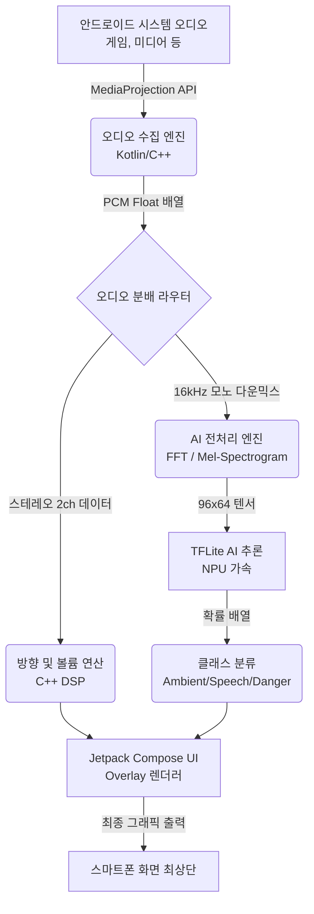

# SoundVisualizer Android - 전체 시스템 아키텍처 및 기술 기획서

이 문서는 스마트폰 내부 소리가 **수집(Capture)되어 AI로 분류(Classification)되고, 최종적으로 화면에 시각화(Rendering)**되기까지의 전체 데이터 파이프라인과 각 단계별로 사용되는 기술 스택을 상세히 기술한 문서입니다.

---

## 🏗 전체 데이터 흐름도 (Data Flow)

---

## 1. 📥 오디오 수집 파이프라인 (Audio Capture)

가장 앞단에서 기기 내부의 소리를 끊김 없이, 지연(Latency) 없이 가져오는 단계입니다.

- **사용 언어**: Kotlin (권한 및 API 제어) + C++ (버퍼 관리)
- **핵심 API**: `MediaProjection` 및 `AudioPlaybackCapture` (Android 10+)
- **작동 방식**:
    1. 앱 실행 시 사용자에게 화면/오디오 녹화 권한(MediaProjection)을 요청합니다.
    2. 안드로이드의 **Foreground Service**(상단 알림바에 고정되는 백그라운드 서비스)를 띄워 앱이 종료되지 않게 보호합니다.
    3. `AudioRecord` 클래스를 통해 내부 소리(스테레오 PCM 데이터)를 실시간 스트리밍으로 가져옵니다.
- **버퍼 관리 (Zero-Latency)**: 자바/코틀린 단에서 배열을 계속 생성하면 가비지 컬렉터(GC)가 작동해 프레임이 끊깁니다. 따라서 수집된 PCM 데이터는 JNI를 통해 **C++로 작성된 Lock-free 링 버퍼(Ring Buffer)**로 즉시 넘겨 보관합니다.

---

## 2. 🧠 전처리 및 AI 분류 파이프라인 (AI Classification)

수집된 오디오 데이터를 가공하고, 신경망 모델에 통과시켜 소리의 정체를 파악하는 단계입니다. 모바일 기기의 배터리 보호를 위해 극한의 최적화가 필요합니다.

- **사용 언어**: C++ (NDK) + Kotlin
- **AI 프레임워크**: **TensorFlow Lite (TFLite)** + `NNAPI` (Android Neural Networks API)
- **사용 모델**:
    - 양자화(Quantized)된 YAMNet TFLite 모델
    - 총소리/위협음 판별용 커스텀 Booster TFLite 모델
- **작동 방식**:
    1. **전처리 (C++ DSP)**: 스테레오 소리를 16kHz 모노로 합치고, 고속 푸리에 변환(FFT)을 수행하여 소리 데이터를 `96x64` 크기의 Log-mel 스펙트로그램 이미지 텐서로 변환합니다. (C++ 단에서 연산하여 CPU 부하 최소화)
    2. **추론 (TFLite)**: 코루틴(Coroutines)을 이용해 250ms마다 백그라운드 스레드에서 TFLite 엔진을 호출합니다. 이때 안드로이드 `NNAPI`를 켜서 폰에 탑재된 전용 AI 칩셋(NPU)을 사용, 배터리 소모를 극적으로 줄입니다.
    3. **후처리 (분류)**: YAMNet이 뱉어낸 521개의 확률 중 가장 높은 것을 바탕으로 `Ambient(배경음)`, `Speech(대화)`, `Danger(위협음)` 3가지 중 하나로 최종 확정합니다.

---

## 3. 🎨 화면 출력 및 렌더링 파이프라인 (Screen Output)

오디오의 크기/방향과 AI의 분류 결과를 결합하여, 유저가 게임을 하는 도중에도 방해받지 않고 볼 수 있는 오버레이(Overlay)를 그리는 단계입니다.

- **사용 언어**: Kotlin
- **UI 엔진**: **Jetpack Compose** (구글의 최신 선언형 UI 툴킷)
- **그래픽 엔진**: `Compose Canvas` (Skia 그래픽 엔진 기반) 또는 `OpenGL ES` (성능이 더 필요할 경우)
- **핵심 API**: `WindowManager` (`TYPE_APPLICATION_OVERLAY`)
- **작동 방식**:
    1. `WindowManager`를 사용해 현재 실행 중인 다른 모든 앱(게임, 유튜브) 위에 투명한 유리창 같은 뷰를 생성합니다.
    2. `FLAG_NOT_TOUCHABLE` 속성을 주어, 유저가 화면을 터치할 때 오버레이를 통과하여 밑에 있는 게임 캐릭터가 움직이도록 합니다.
    3. **시각화 렌더링**:
        - **크기/방향**: 수집 단계에서 넘겨받은 좌(L)/우(R) 채널의 볼륨 비율을 바탕으로, 화면 좌우 가장자리에 표시될 파도(Wave)나 패드(Pad)의 두께와 높이를 60fps로 계산하여 그립니다.
        - **색상**: AI 분류 단계에서 넘어온 상태에 따라 파도의 색상을 바꿉니다 (예: 대화음=초록색, 위협음=붉은색+스마트폰 진동 발생).
    4. 가로/세로 화면 회전(`Configuration Change`) 시 즉각적으로 오버레이의 레이아웃 경계를 재계산하여 화면 밖으로 UI가 삐져나가지 않게 조정합니다.